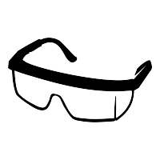

# Choisir ses outils de recherche à l'ère du numérique {#sec-chap1}

\begin{center}
\textit{Jozef Rivest (University of Michigan), \\
Catherine Ouellet (Université de Montréal)}
\end{center}

{fig-align="center" width="12%"}

Ce premier chapitre ne présente pas un outil en soi. Il vise à initier les lecteurs à la philosophie du logiciel libre et, surtout, à situer ces réflexions dans le contexte de la recherche en sciences sociales. À la fin de ce chapitre, les lecteurs sont en mesure de situer les nombreux outils numériques dans le grand univers des logiciels libres et propriétaires, et de comprendre les motivations derrière le développement et l'utilisation des logiciels. La sélection d'un outil dépasse le simple calcul des coûts et bénéfices utilitaires, gratuit contre payant. Ce choix s'inscrit dans un ensemble de réflexions philosophiques, éthiques et épistémologiques plus grand qui continue, encore à ce jour, à influencer les développeurs et les utilisateurs. Tout au long de ce chapitre, il est démontré que certaines de ces motivations rejoignent la méthode scientifique, au cœur de la quête de savoir et de compréhension du monde social [@king_etal21]. Ce chapitre jette ainsi la base réflexive derrière le choix des outils numériques présentés dans ce livre, dans lequel nous avons tenté de joindre les avantages des logiciels libres avec les autres critères de sélection nécessaires à prendre en compte, dans le but de créer un environnement de travail efficace autant sur le plan individuel que collaboratif. Les outils numériques s'inscrivent dans chacune des grandes étapes de la recherche : avant, pendant et après.

Avant d'aller plus en profondeur, la distinction entre « outil » et « méthodologie » doit être faite, afin de clarifier le but de ce livre et la terminologie utilisée. La méthodologie est le champ de la philosophie des sciences qui s'intéresse à l'étude des méthodes scientifiques ou techniques. Celles-ci visent à collecter et à analyser des données, suivant les impératifs scientifiques, et ont pour but de contribuer au savoir et à la connaissance. Il faut faire attention puisque dans certains ouvrages il est possible que les auteurs décrivent les méthodes qu'ils ont utilisées comme étant des *outils*. D'un point de vue méthodologique, lié à la philosophie des sciences, il est approprié d'utiliser ce genre de vocabulaire. Ainsi, la régression linéaire, le *clustering*, les entretiens semi-dirigés et l'analyse de contenu sont des méthodes. En revanche, les outils numériques qui sont présentés dans ce livre ne sont pas des méthodes scientifiques. Des outils numériques comme $\textsf{R}$, *Dropbox* ou *GitHub* ne sont pas des méthodes, mais des outils qui permettent de structurer sa pensée, d'organiser son espace et son environnement de travail, et d'implémenter son protocole de recherche afin de collecter et d'analyser des données et d'en dériver des conclusions. Il est donc utile de distinguer les outils numériques des méthodes. Les outils sont à la science ce que le mélangeur, la cuillère et la spatule sont à la cuisine. La méthodologie, c'est la recette.

Ce livre ne vise donc pas à présenter des *outils méthodologiques*, compris ici comme étant des outils qui permettent de *concevoir*, d'exécuter et d'évaluer une recherche [@brady_collier10]. Le but est plutôt de présenter des choix *d'outils numériques* qui ont un fort potentiel pour aider les chercheurs à *structurer leur pensée, à organiser leur espace de travail et à implémenter certaines méthodes*. Cette distinction est importante puisqu'elle définit la distinction entre ce livre et les nombreux livres de méthodes déjà disponibles sur le marché.

Le logiciel libre a, et continue d'avoir, une place importante dans le développement des outils numériques. Dans les sections suivantes, l'historique de cette philosophie est présenté afin de mettre en contraste et mieux comprendre ses motivations et revendications. Après cette mise en contexte suit une discussion concrète sur la distinction entre logiciel propriétaire et libre, puis sur la différence entre le logiciel libre et le code source ouvert. Après coup, nous aborderons en quoi ces réflexions sont importantes pour les sciences sociales à l'ère du numérique, ainsi que les avantages et les inconvénients qui y sont liés.

Cette discussion sur le logiciel libre se veut ainsi un préambule aux critères de sélection qui ont justifié les choix des outils numériques présentés dans ce livre.

## Point d'observation : le numérique en sciences sociales

### La philosophie du logiciel libre

*« Vous n'avez pas à suivre une recette avec précision. Vous pouvez laisser de côté certains ingrédients. Ajouter quelques champignons parce que vous en raffolez. Mettre moins de sel, car votre médecin vous le conseille --- peu importe. De surcroît, logiciels et recettes sont faciles à partager. En donnant une recette à un invité, un cuisinier n'y perd que du temps et le coût du papier sur lequel il l'inscrit. Partager un logiciel nécessite encore moins, habituellement quelques clics de souris et un minimum d'électricité. Dans tous les cas, la personne qui donne l'information y gagne deux choses : davantage d'amitié et la possibilité de récupérer en retour d'autres recettes intéressantes. »* - Richard Stallman [@williams_etal10].

Cette analogie illustre bien trois concepts au cœur de la philosophie de Richard Stallman, souvent considéré comme le père fondateur du logiciel libre : liberté, égalité, fraternité. Les utilisateurs de ces logiciels sont libres, égaux, et doivent s'encourager mutuellement à contribuer à la communauté. Ainsi, un logiciel libre est généralement le fruit d'une collaboration entre développeurs qui peuvent provenir des quatre coins du globe. Au centre de ce mouvement se trouve une réflexion éthique à propos de la liberté des utilisateurs, dont les militants font campagne depuis le début des années 1980. La Free Software Foundation (FSF), fondée par Richard Stallman en 1985, définit le logiciel « libre » \[free\] comme étant garant de quatre libertés fondamentales de l'utilisateur :

1.  la liberté d'utiliser le logiciel comme on le souhaite, pour n'importe quel usage ;
2.  la liberté d'étudier son fonctionnement et de le modifier selon ses besoins, ce qui suppose l'accès au code source ;
3.  la liberté d'en redistribuer des copies ;
4.  la liberté de distribuer des copies de ses versions modifiées[^chapitre_1-1].

Il s'agit ainsi d'un logiciel dont le code source[^chapitre_1-2] est disponible, afin de permettre aux internautes de l'utiliser tel quel ou de le modifier à leur guise. L'accès au code source devient essentiel afin de permettre à l'utilisateur de savoir ce que le programme fait réellement. Seulement de cette façon, l'utilisateur peut *contrôler* le logiciel, plutôt que de se faire contrôler par ce dernier [@stallman86].

[^chapitre_1-1]: La redistribution doit évidemment respecter certaines conditions précises, dont la violation peut mener à des condamnations \[http://www.softwarefreedom.org/resources/2008/shareware.html\]

[^chapitre_1-2]: Pour rester dans les analogies culinaires, le code source est au logiciel ce que la recette est à un plat: elle indique les actions à effectuer, une par une, pour arriver à un résultat précis. Encore une fois, ce dernier peut être adapté, modifié, bonifié.

### L'émergence et la sémantique du *libre*

Plusieurs situent les débuts du mouvement du logiciel libre en 1983, quand Richard Stallman lance le projet GNU. GNU, pour « GNU's Not Unix », est un système d'exploitation complet, écrit pour être libre de bout en bout, en réaction à des logiciels qu'on ne pouvait plus ni lire ni modifier. Sa licence publique générale, la GPL, publiée en 1989, garantit ces libertés à quiconque reçoit le logiciel, et elle protège encore aujourd'hui une multitude de logiciels libres. Parmi les plus populaires se trouvent le navigateur *Firefox*, la suite bureautique *OpenOffice* et l'emblématique système d'exploitation *Linux*, dont le noyau est distribué sous cette licence. Aujourd'hui, il s'agit d'un véritable phénomène sociétal: des milliers d'entreprises, d'organisations à but non lucratif, d'institutions ou encore de particuliers adoptent ces logiciels, dont la culture globale et les valeurs (entraide, collaboration, partage) s'arriment avec le virage technologique de plusieurs entreprises. Les logiciels libres ont différents usages, en passant par la conception Web, la gestion de contenu, les systèmes d'exploitation, la bureautique, entre autres. Ils permettent donc de répondre à plusieurs types de besoins numériques et informatiques.

Il est important de rappeler que le logiciel libre est avant tout une philosophie, voire un mouvement de société. C'est une façon de concevoir la communauté du logiciel où le respect de la liberté de l'utilisateur est un impératif éthique [@williams_etal10]. Par conséquent, le terme libre, *free* en anglais, porte à confusion. Celui-ci ne signifie pas qu'un logiciel libre est nécessairement gratuit. Certes, plusieurs sont effectivement téléchargeables gratuitement. Toutefois, il est aussi possible de (re)distribuer des logiciels libres payants. Par ailleurs, aucun logiciel libre n'est réellement « gratuit » dans la mesure où son déploiement et son utilisation nécessitent généralement différents coûts, dont les montants sont variables en fonction des compétences et de l'infrastructure dont disposent les utilisateurs (coût d'apprentissage, coûts d'entretien, etc.). Enfin, il est important de garder en tête que les logiciels libres possèdent eux aussi une licence, qui est d'ailleurs garante des libertés que confèrent les logiciels libres aux utilisateurs.

La grande liberté que ce type de logiciel offre favorise notamment la collaboration entre les utilisateurs, et ce, à une échelle pouvant être internationale. Les interactions entre les chercheurs créent une dynamique d'« innovation ascendante » et d'entraide [@couture14]. En d'autres termes, l'accessibilité et la collaboration favorisent le développement et l'amélioration de ces logiciels. Selon certains, et comparativement aux logiciels propriétaires, les logiciels libres ont un niveau plus élevé d'innovation [@smith02]. Contrairement aux logiciels propriétaires qui se développent de manière privée et fermée, les logiciels libres permettent à tous les utilisateurs de participer au développement. Ceux-ci partagent ensuite leurs améliorations, ce qui stimule de nouveau des initiatives. De plus, il est raisonnable de penser que l'utilité des améliorations, ainsi que l'utilisation qui en est faite par les utilisateurs, permet de générer un savoir collaboratif [@couture20].

Il y a aussi certains avantages économiques, dont un faible coût d'acquisition et de renouvellement pour les particuliers. Cet avantage individuel génère plusieurs externalités positives. Tout d'abord, certains logiciels statistiques ainsi que certains programmes informatiques coûtent plusieurs centaines, voire des milliers de dollars, et dans certains cas doivent être renouvelés annuellement. Cela augmente les coûts associés à l'utilisation du logiciel et par conséquent limite son accessibilité. Comparativement, pour les logiciels libres, la licence d'acquisition coûte bien souvent moins cher, et aucun renouvellement de licence n'est demandé dans la plupart des cas. L'argent économisé sur les licences peut alors être investi dans le développement du logiciel libre [@beraud07]. De plus, étant donné que les chercheurs doivent souvent faire face à des contraintes budgétaires, les logiciels libres deviennent des outils intéressants afin de minimiser les coûts de la recherche [@yu_munoz-justicia22]. Il s'agit d'un avantage encore plus important et intéressant pour les chercheurs dans les pays du Sud global [@santillan-anguiano_gonzalez-machado23]. L'accessibilité de ces ressources permet donc de réduire l'écart dans la production scientifique entre les pays du Sud et ceux du Nord. De plus, elle permet à tous de bénéficier d'outils pédagogiques accessibles, ce qui favorise l'acquisition ainsi que le développement de compétences méthodologiques.

Il est important de souligner que la transition vers les logiciels libres ne doit pas se faire seulement sur des bases économiques, mais dans une perspective globale de changement de culture. Changer pour des raisons purement économiques reviendrait à violer l'essence même de la philosophie du logiciel libre, qui se veut surtout être un esprit de collaboration et de transparence. Amélioration constante, entraide, savoir partagé et plusieurs milliers de contributeurs [@couture14], ces éléments résument très bien la philosophie du logiciel libre.

À cette dimension culturelle s'ajoute une responsabilité proprement universitaire. Une grande partie de la recherche est financée par des fonds publics, c'est-à-dire par l'ensemble de la collectivité. Ce financement s'accompagne d'un devoir de transparence et d'une responsabilité de redonner à la société qui rend ce travail possible. Partager un code ouvert, documenté et réutilisable dépasse la simple bonne pratique méthodologique et participe directement à la mission universitaire de produire et de diffuser un savoir accessible au plus grand nombre.

### Quelques exemples concrets

Considérons quelques exemples de logiciels libres et de logiciels propriétaires afin de mettre en relief les trois éléments présentés ci-haut: 1) la liberté de l'utilisation et de la contribution; 2) les coûts d'acquisition; et 3) les compétences acquises et développées. Dans les chapitres suivants, des outils numériques tels que $\textsf{R}$, *SPSS*, *STATA*, qui permettent de mener des analyses statistiques, ou encore la suite *Office*, `Quarto`, \LaTeX, qui permettent de formater un document écrit, sont présentés. Cette section ne remplace en aucun cas une lecture approfondie et détaillée des chapitres suivants. Au besoin, nous recommandons fortement aux lecteurs de se référer au reste du livre.

En ce qui concerne le premier trio, $\textsf{R}$ est le seul logiciel libre du groupe. Il est accessible gratuitement à partir du site web de CRAN, et une grande communauté d'utilisateurs contribue activement à son développement. Par exemple, la compagnie *Posit* est derrière le développement de `RStudio`, `Quarto` et `Positron` qui sont toutes des extensions à code source ouvert de $\textsf{R}$. Ensuite, plusieurs utilisateurs ont développé des librairies avec des commandes et des fonctions supplémentaires, qui sont gratuites et dont le code est disponible sur des plateformes comme *GitHub*.

Contrairement à $\textsf{R}$, *SPSS* et *STATA* sont des logiciels propriétaires qui nécessitent une licence privée pour pouvoir les utiliser. L'achat d'une licence doit aussi être évalué en fonction de ses propres besoins puisque, dans le cas de *SPSS*, les licences ne donnent pas toutes accès aux mêmes fonctionnalités. Ainsi, la licence de base ne donne pas accès à l'utilisation de la régression, alors que la licence Premium le permet. De plus, la licence doit être renouvelée tous les ans et coûte plusieurs milliers de dollars pour un seul utilisateur. En ce qui concerne *STATA*, la logique est similaire à celle de *SPSS*. Différents types de licence sont offerts avec des fonctionnalités supplémentaires, notamment en termes de rapidité de l'exécution des fonctions et de la capacité à traiter une large quantité d'observations. Les licences annuelles pour les étudiants coûtent quelques centaines de dollars, et plus d'un millier de dollars pour les autres utilisateurs. De plus, *SPSS* et *STATA* sont développés uniquement par les compagnies *IBM* et par *StataCorp* respectivement. Bien qu'ils n'offrent pas la même flexibilité que $\textsf{R}$ et que les utilisateurs ne peuvent pas contribuer au développement au même titre que $\textsf{R}$, ils offrent d'importantes ressources pour les utilisateurs, notamment par l'entremise d'un service à la clientèle, de documentations et de formation web, par exemple. Ainsi, les utilisateurs sont « pris en charge » directement par la compagnie afin de leur fournir de l'aide et du support.

En ce qui concerne les langages de balisage, \LaTeX{} ou `Quarto` peuvent être utilisés gratuitement sur des interfaces comme `RStudio` ou `VS Code`. Ils offrent donc une grande flexibilité étant compatibles avec plusieurs interfaces. Ainsi, une fois que les compétences avec le langage ont été développées, il est facile de les transposer d'une interface à une autre. À l'inverse, la suite *Office* offre ses propres interfaces qui sont plutôt intuitives, mais qui contraignent l'utilisateur à des fonctions prédéfinies. De plus, une licence de la suite *Office* coûte une centaine de dollars par année. De même qu'avec *STATA* et *SPSS*, *Microsoft* offre plusieurs ressources directement sur leur site web pour les utilisateurs. Ainsi, un certain « encadrement » est offert par la compagnie.

Deux éléments importants doivent toutefois être soulevés. Il ne faut pas penser que les logiciels libres sont dénués de support et de documentation. La plupart des logiciels libres et leurs extensions, comme les librairies sur $\textsf{R}$, offrent de l'aide et des indications d'utilisation, et plusieurs forums d'utilisateurs permettent le partage de problèmes et de solutions. Certains tutoriels sont disponibles sur YouTube ou sur des plateformes comme *Datacamp* et *CodeAcademy*. L'intelligence artificielle générative est également particulièrement habile pour travailler avec les langages de programmation et les logiciels libres. Les utilisateurs ne sont donc pas totalement laissés à eux-mêmes. De plus, plusieurs universités offrent des licences pour des logiciels aux étudiants, comme *Office* ou *SPSS*, pour éviter que ceux-ci aient à débourser d'importantes sommes pour acquérir ces logiciels.

### Le code source ouvert

Parallèlement au logiciel libre, il y a aussi le code source ouvert, ou *open source*. À priori, la dénomination du logiciel libre et celle du *code source ouvert* semblent suggérer qu'il s'agit de synonymes. Dans les deux cas, le lecteur pourrait croire que l'on fait référence à des logiciels, par exemple, qui sont exempts de restrictions d'utilisation et auxquels les utilisateurs peuvent participer au développement. Cependant, il y a une distinction importante entre les deux.

Le logiciel libre et le code source ouvert renvoient sensiblement aux mêmes types de logiciels, toutefois leurs approches diffèrent. Selon @stallman22, le logiciel libre est avant tout un mouvement qui défend la liberté des utilisateurs de l'informatique, ce qui représente son principe central. Le code source ouvert, quant à lui, bien que partageant ce principe, met davantage l'accent sur les bénéfices pratiques et concrets pour les utilisateurs et pour le développement du logiciel. Il se concentre ainsi sur l'application concrète du principe, plutôt que sur la promotion de principes idéologiques.

Le terme *code source ouvert* sera introduit seulement en 1998 afin de clarifier l'ambiguïté dans la dénomination « logiciel libre » [^chapitre_1-5], *free software* en anglais, afin de spécifier que le code source était accessible, et non pas que le logiciel était « gratuit » [@ballhausen19]. De plus, les logiciels à code source ouvert doivent respecter un certain nombre de critères quant à la distribution de leurs logiciels [@opensourceinitiative06].

[^chapitre_1-5]: Soit ceux qui ont été conçus suivant les principes philosophiques et éthiques qui sous-tendent ce mouvement.

Rappelons tout d'abord que le logiciel libre se définit sur la base des quatre libertés présentées plus haut [@ballhausen19]. Concernant le code source ouvert, tout logiciel qui souhaite être inclus sous cette appellation doit respecter dix critères[^chapitre_1-6] [@opensourceinitiative06] :

1.  la redistribution doit être libre, sans redevance ni frais ;
2.  le programme doit inclure son code source, ou permettre de l'obtenir facilement ;
3.  la licence doit autoriser les modifications et les travaux dérivés, distribués aux mêmes conditions ;
4.  l'intégrité du code source de l'auteur peut être protégée, par exemple en exigeant que les modifications soient distribuées sous forme de correctifs séparés ;
5.  la licence ne doit discriminer aucune personne ni aucun groupe ;
6.  la licence ne doit restreindre aucun domaine d'utilisation, commercial ou autre ;
7.  les droits attachés au programme s'appliquent à tous ceux à qui il est redistribué, sans licence supplémentaire ;
8.  la licence ne doit pas être liée à un produit ou à une distribution en particulier ;
9.  la licence ne doit pas imposer de restrictions aux autres logiciels distribués avec le programme ;
10. la licence doit être technologiquement neutre.

[^chapitre_1-6]: Pour plus d'informations sur ces caractéristiques, nous encourageons les lecteurs à se référer au lien web de @opensourceinitiative06.

Il est aussi utile de les distinguer des logiciels « non libres », soit les logiciels propriétaires: « Son utilisation, sa redistribution ou sa modification sont interdites, ou exigent une autorisation spécifique, ou sont tellement restreintes qu'en pratique vous ne pouvez pas le faire librement » [@systemedexploitationgnu23]. Par contraste, la licence libre confère des droits de propriétaire. L'utilisateur a le droit d'installer le logiciel sur autant d'ordinateurs que désiré, de le modifier selon ses besoins et de le distribuer avec ou sans ses modifications. Il peut même demander d'être payé pour distribuer des copies, avec ou sans ses modifications.

Le logiciel libre et le code source ouvert ont certaines similitudes puisqu'ils adhèrent tous les deux à la même vision du logiciel, ainsi que de son accessibilité. Toutefois, il est important de les distinguer malgré tout, puisqu'ils ont des origines différentes et qu'ils mènent à certaines pratiques qui sont différentes. La prochaine section utilise un cas concret afin d'expliquer l'effet du libre et son utilité.

### Les enseignements du *libre* pour les sciences sociales

En quoi est-ce que ces deux concepts, issus du monde de l'informatique, sont-ils intéressants et/ou importants pour les sciences sociales ? Pour répondre à cette question, il est important de retourner à la base, c'est-à-dire de se questionner sur ce que constitue la recherche scientifique en sciences sociales.

Dans leur célèbre ouvrage *Designing Social Inquiry*, @king_etal21 proposent quatre critères qui définissent la recherche scientifique: 

1. le but est l'inférence ; 
2. les procédures sont publiques ; 
3. les conclusions sont incertaines ; 
4. le contenu est la méthode. 

La philosophie du logiciel libre et les avantages pratiques du code source ouvert s'arriment parfaitement avec ces critères. Plusieurs outils numériques rendent possibles le partage et l'accès public des données et de la méthode utilisée, rejoignant ainsi le critère des procédures publiques et celui de la méthode comme contenu. Certains de ces outils seront d'ailleurs abordés dans les chapitres suivants. L'accès aux données et aux procédures d'analyse est un impératif scientifique. Comme nous l'aborderons un peu plus loin, il y a toujours des concessions à faire lors des investigations scientifiques. Par conséquent, un meilleur accès aux procédures et aux données utilisées permet de cibler plus facilement les limites de certaines recherches et de les combler lors de recherches ultérieures. De plus, l'utilisation des données massives ouvre de nouvelles portes, mais surtout de nouveaux défis relatifs à la validité interne et externe ainsi qu'au type de données récoltées et à la validité écologique [@marres17]. Face au constat que la vie sociale se trouve affectée par les changements numériques, il nous faut en tant que chercheurs du monde social réfléchir à notre façon de comprendre ces changements. Ainsi, face à ces défis, une des solutions se trouve notamment dans un meilleur partage et dans une meilleure accessibilité aux données et aux procédures.

Il est possible de faire certains liens avec les deux autres critères de @king_etal21. Premièrement, comme le but de la science est l'inférence, c'est-à-dire de tenter d'expliquer des phénomènes sociaux qui s'inscrivent dans des catégories plus larges que nos observations directes, il est important que nos conclusions soient soumises au plus grand nombre possible et pas uniquement au comité éditorial d'une revue scientifique. D'une part, la validité de nos résultats a un potentiel politique important. Plusieurs décisions peuvent être prises sur la base des connaissances et de la compréhension des dynamiques sociales. Il est donc important que les résultats de recherche qui informent ces décisions soient les plus rigoureux possible, et qu'ils aient été soumis à l'examen critique par le plus grand nombre d'individus. D'autre part, et comme @king_etal21 le font remarquer, les conclusions sont toujours incertaines. L'examen critique et la reproduction des protocoles sont donc une nécessité dans ce contexte d'incertitude constant. La science ne cherche pas à être dogmatique et c'est avant tout l'incertitude qui caractérise la science. Les résultats sont toujours incertains et la recherche a alors pour but de renforcer notre niveau de confiance envers certaines explications, tout en écartant d'autres pistes d'explications alternatives. Comme plusieurs de ces phénomènes ne sont ni homogènes ni immuables, notre compréhension et notre explication de ces dynamiques doivent être constamment revues.

Chacun de ces outils a toutefois ses forces et ses faiblesses. Inspiré de @przeworski_teune70, @brady_collier10 parlent ainsi de *compromis*. Selon eux, la pertinence d'un outil méthodologique dépend de la question de recherche, du but de la recherche et de son contexte. Le choix d'un outil, sur cette base, entraîne des compromis qui empêchent d'atteindre tous les buts analytiques simultanément. Même lorsqu'il y a adéquation entre la question et la méthode, plusieurs autres embuches peuvent entraîner ces compromis, comme la disponibilité des données par exemple, qui limitent par la suite la qualité et la précision des résultats, ce qui explique, en partie, l'incertitude envers les conclusions.

```{=html}
<!--
Il est intéressant de concevoir la réalité sociale comme étant un prisme ayant un nombre infini de face. Chacune de ces faces correspond à une compréhension partielle de la réalité. Pour y avoir accès, nous devons utiliser une méthode de collecte et d'analyse de données, informées par une question de recherche et/ou par la théorie[^chapitre_1-11]. Étant donné que chaque outil méthodologique à ses limites et que nous devons constamment faire des compromis, notre compréhension de la réalité n'est que partielle une fois la recherche complétée. De plus, il ne faut pas oublier que la compréhension que nous avons de cette face reste incertaine.
-->
```

<!-- [^chapitre_1-11]: Nous préférons formuler la phrase ici en stipulant que le choix d'une méthode de recherche peut être informé par la théorie et notre question de recherche simultanément, mais peut aussi être fait seulement à partir d'une question de recherche. Cela fait référence à deux processus de recherche différents soit la méthode hypothético-inductive, et celle déductive. -->

En somme, les enseignements de la philosophie du code source ouvert, les avantages pratiques du logiciel libre et les outils qui en découlent ont le potentiel de permettre non seulement une plus grande transparence des protocoles scientifiques, mais aussi un plus grand partage du savoir, et ce, du début de la recherche jusqu'à la publication des résultats.

### Les avantages et les limites

Jusqu'à présent, il a surtout été question des avantages liés aux logiciels libres. Toutefois, il n'y a pas que des points positifs, et il serait malhonnête de ne pas aborder certaines de leurs limites.

Dans leur texte, @paura_arhipova12 soulèvent une critique portée contre certains logiciels libres, notamment contre $\textsf{R}$. Le problème principal d'enseigner avec des logiciels libres est qu'ils peuvent être compliqués à apprendre et à utiliser; par conséquent, les étudiants passeraient plus de temps à tenter de résoudre les erreurs de programmation plutôt qu'à apprendre et à mener leurs analyses[^chapitre_1-8]. Par exemple, $\textsf{R}$ demande l'apprentissage d'un langage de programmation afin de pouvoir utiliser le logiciel à son plein potentiel. De plus, la syntaxe de certaines librairies demande aussi un certain temps d'adaptation. À titre de comparaison, le logiciel *SPSS* offre une interface beaucoup plus intuitive que $\textsf{R}$, dans lequel l'utilisateur peut simplement cliquer sur les différents menus dans la barre d'outils afin de sélectionner les analyses qu'il ou elle souhaite faire. *SPSS* présente ses résultats dans des tableaux qui sont clairs et lisibles, contrairement à $\textsf{R}$ où plusieurs fonctions présentent les résultats directement dans la console, sous un format moins « esthétique ». De plus, la plupart des logiciels propriétaires viennent avec un certain service à la clientèle. En d'autres termes, lorsque les utilisateurs rencontrent des problèmes techniques, ils peuvent se référer au manuel d'utilisateur ou bien par l'entremise de l’assistance technique qui est offerte par la compagnie. À l'opposé, la plupart des logiciels libres ne sont pas accompagnés d'un service à la clientèle. Les utilisateurs doivent donc se débrouiller par eux-mêmes lorsqu'ils rencontrent des difficultés et des problèmes.

[^chapitre_1-8]: Sur cet enjeu, nous conseillons aux lecteurs de lire le @sec-chap2 sur les langages de programmation ainsi que le @sec-chap9 sur l'intelligence artificielle. Plusieurs trucs et astuces seront présentés dans ces chapitres.

<!-- NOTE: En ce qui concerne le commentaire sur l'explication des packages, mettre la note de bas de page qui explique ce que c'est plus haut dans le texte -->

Cet argument tient moins bien quand on met le coût de l'apprentissage en face de ce qu'il rapporte. D'abord, la syntaxe de $\textsf{R}$ n'est pas parmi les plus difficiles, et elle se combine bien avec des extensions comme `Quarto` ou `RMarkdown`, qui permettent de présenter ses résultats sous forme de rapport, d'article, de site web ou de blogue. Surtout, la logique de base de $\textsf{R}$ reste la même d'une librairie à l'autre. Une fois qu'on la comprend, apprendre une nouvelle librairie va vite, et certaines, comme `dplyr` du `tidyverse`, simplifient beaucoup la manipulation des données par rapport aux commandes de base. Ensuite, pour quiconque travaille avec des données, de près ou de loin, ce qu'on gagne dépasse largement ce qu'on investit. Ces compétences servent toute une carrière, alors que l'apprentissage se compte en semaines ou en mois. Enfin, les logiciels plus intuitifs n'offrent pas la même flexibilité que la plupart des logiciels libres, ou alors cette flexibilité se paie, fonctionnalité par fonctionnalité. Quant à l'absence de service à la clientèle, les communautés d'utilisateurs la compensent largement. Sur un forum comme *Stack Overflow*, une question bien posée trouve presque toujours sa réponse.

#### Un enjeu de transparence

L'arrivée des sciences informatiques a fait émerger des problèmes de reproductibilité des protocoles scientifiques [@janssen17]. Le problème principal est relatif à l'accès au code utilisé par les chercheurs. Par exemple, il est possible de réaliser des analyses statistiques avec $\textsf{R}$ sans partager le code utilisé, ce qui limite la transparence du processus scientifique. Dans cette situation, il est difficile de savoir si des erreurs de codage ont été commises, volontairement ou involontairement, affectant ainsi les résultats partagés.

Afin de remédier à ce problème, des outils comme *GitHub*[^chapitre_1-9] participent à la transparence des résultats scientifiques [@fortunato_galassi21]. La plateforme permet aux chercheurs de partager leur code pour que tous puissent y accéder. Son installation et sa configuration demandent un certain effort à qui n'a jamais touché à ces outils, et c'est une barrière réelle. Nous la présentons quand même, parce qu'elle rend les processus et les résultats de recherche plus transparents. Si l'on analyse, par exemple, la relation entre l'économie et le vote, on peut déposer sur *GitHub* l'ensemble du code utilisé. D'autres pourront vérifier que les résultats tiennent la route, et reprendre le code pour leurs propres analyses.

[^chapitre_1-9]: Une plateforme publique à code source ouvert sur laquelle on héberge et partage son code. Git et *GitHub* sont présentés au @sec-chap4.

Reste que le partage du code demeure, la plupart du temps, un geste volontaire. @janssen_etal20 plaident pour des efforts concertés, par exemple que les revues exigent le dépôt du code au moment de la publication. Une étude sur ce qui pousse les chercheurs à partager leur code va dans le même sens. Les bonnes intentions individuelles ne suffisent pas [@krahmer_etal23]. Pour que la pratique se généralise, il faut qu'elle devienne une norme portée par les institutions.

#### De l'appropriation commerciale

Dans ce cas-ci, il s'agit plutôt d'un défi auquel le logiciel libre est confronté plutôt qu'une critique quant aux limites de son utilisation. En fait, l'accès au code source ainsi que la liberté et la possibilité de contribuer au développement du logiciel constituent un avantage intéressant pour les compagnies privées. Par conséquent, nous avons assisté à une intégration partielle du logiciel libre dans la logique capitaliste [@broca13; @bessen02]. Certaines compagnies profiteraient des utilisateurs comme une main-d'œuvre gratuite afin de bonifier leur logiciel, ce qui permet, dans certains cas, de générer des revenus commerciaux dont l'entreprise est la seule bénéficiaire [@couture20]. Attention, il ne faut pas penser que toutes les compagnies agissent de manière prédatrice. Le but ici est de souligner que certaines pratiques commerciales troublent l'essence du mouvement du logiciel libre, qui se veut davantage être un outil de collaboration accessible, plutôt qu'un moyen pour générer des profits. Il est important de garder en tête les valeurs et la philosophie qui ont donné lieu à ce mouvement.

## Manuel d'instruction: le *libre* au cœur du cycle de la recherche

Malgré ces limites et ces défis, nous pensons que les différents outils numériques ont leur place en sciences sociales, et qu'ils s'inscrivent parfaitement à chaque étape de la recherche. Bien que le partage soit encore majoritairement opéré sur une base volontaire, adopter cette pratique dès maintenant est important pour s'engager vers une science plus ouverte et transparente. Quant à cette dernière caractéristique, il ne faut pas croire que le partage des résultats se limite à une conférence ou à une publication scientifique. Bien au contraire, tout chercheur qui souhaite être le plus transparent doit s'engager dans ce processus dès la conception de sa recherche.

Avant de présenter différents outils, il faut préciser en quoi la transparence et l'accessibilité sont bénéfiques pour tous. D'une part, et comme nous l'avons présenté dans la section précédente, la transparence est une caractéristique fondamentale de toute recherche qui se veut scientifique. Elle est aussi liée à l'intégrité du chercheur. Il est impératif de faire état du processus qui mène à notre conclusion, de la sélection de nos données jusqu'à l'analyse. C'est de cette façon que nous pouvons juger de la validité et de la fiabilité des inférences, et surtout de ses limites. D'autre part, la transparence favorise aussi l'apprentissage [@king_etal21]. Rendre publics et accessibles, à l'aide des outils numériques, les données, le code et la ou les méthodes utilisées permet de contribuer non seulement aux débats méthodologiques, mais aussi permet à d'autres chercheurs d'apprendre sur l'utilité et l'utilisation de ces méthodes.

Finalement, la transparence dans les sciences sociales est aussi une question d'imputabilité. La recherche scientifique est, dans bien des cas, financée par des fonds publics. À partir des taxes et des impôts qui sont collectés, le gouvernement finance des projets de recherche qui sont sélectionnés sur une base compétitive. La communauté scientifique est donc redevable face à la population et aux décideurs publics des progrès faits en utilisant cet argent. Ainsi, l'utilisation de logiciels libres et ouverts ainsi que la diffusion publique du processus de recherche devraient être au cœur des priorités de tous les chercheurs non seulement pour des raisons d'imputabilité, mais aussi pour des raisons de qualité démocratique de nos systèmes politiques.

Les prochaines sous-sections présentent comment ces outils s'inscrivent à chaque étape du processus de recherche scientifique. Le but ici est de nourrir la réflexion quant à l'utilisation personnelle de ces outils et d'encourager une science plus ouverte.

### Avant la recherche

Au fil des prochains chapitres, les lecteurs apprendront un nouveau jargon. Au même titre qu'une langue comme le français, l'anglais ou le japonais, ce langage permet de communiquer, et surtout de réfléchir. Cette nouvelle langue, riche en nouveaux concepts, amènera le lecteur à développer une nouvelle manière de réfléchir à la recherche et à son organisation. Ainsi, le lecteur sera outillé pour visualiser sa recherche dans toute son ampleur, de cibler ses besoins en fonction de son but et de ses intérêts, et ainsi d'organiser son environnement de travail en conséquence.

Le chercheur qui vise la transparence s'engage dès le départ. Il crée d'abord le dépôt *GitHub* de son projet, où vivront son code et ses données (@sec-chap4), et il organise son flux de travail (@sec-chap3). Il fait ensuite sa revue de littérature avec des outils qui gardent la trace de ce qu'il a lu et retenu (@sec-chap5). Une fois le plan de recherche[^chapitre_1-10] établi, il peut le préenregistrer sur l'*Open Science Framework*[^chapitre_1-11]. Le principe est simple. On dépose ses hypothèses, sa méthode et son plan d'analyse avant de collecter et d'analyser les données. On se lie ainsi les mains, dans le bon sens du terme. On ne peut plus ajuster ses hypothèses après coup pour qu'elles collent aux résultats, ni laisser tomber en silence ceux qui déçoivent. Un résultat négatif annoncé d'avance reste un résultat, et il épargne à d'autres de refaire le même chemin.

[^chapitre_1-10]: Généralement, un plan de recherche comprend les éléments suivants : Introduction, revue des écrits, problématiques, une question de recherche, un cadre théorique, des hypothèses ainsi qu'une section sur la méthode et les données utilisées.

[^chapitre_1-11]: L'*Open Science Framework* (https://osf.io) et le préenregistrement sont présentés au @sec-chap4.

### Pendant la recherche

Une fois la recherche lancée, les outils prennent le relais à chaque étape. La collecte des données, du sondage à l'extraction web, occupe le @sec-chap6. Leur analyse passe par $\textsf{R}$ (@sec-chap2) et leur visualisation par `ggplot2` (@sec-chap7). Tout au long du projet, Git et *GitHub* (@sec-chap4) gardent l'historique du travail et le partagent avec les collaborateurs, pendant que des services comme *Dropbox* mettent les fichiers à l'abri d'un ordinateur qui rend l'âme. La rédaction se fait dans des langages de balisage comme `Quarto` (@sec-chap8), et l'intelligence artificielle (@sec-chap9) peut assister chacune de ces étapes, à condition d'en garder le contrôle.

### Après la recherche

Une fois l'article écrit et publié, les auteurs peuvent décider de rendre accessible le matériel produit et utilisé en version gratuite sur le web. Il s'agit de l'*open science*, ou de la science ouverte [@chakravorty_etal22]. Le dépôt *GitHub* ouvert au départ devient alors la vitrine du projet, avec le code, les données et le texte, et la bibliographie tenue dans *Zotero* (@sec-chap5) se partage tout aussi facilement.

Cela permet de rendre non seulement les publications accessibles à tous sur internet gratuitement, mais aussi de permettre l'accès aux données utilisées pour la réalisation d'une étude, par exemple. Ces données peuvent ensuite être réutilisées par d'autres chercheurs. Il s'agit d'avantages importants, et surtout très prometteurs. D'une part, un plus grand accès au savoir scientifique permet aux décideurs publics de prendre des décisions qui s'appuient sur la science, et idéalement, sur une pluralité de sources scientifiques afin de pouvoir évaluer adéquatement les effets positifs et négatifs. <!--D'autre part, la société civile a tout à gagner d'avoir un meilleur accès aux publications scientifiques.--> 

Finalement, la réutilisation des données peut réduire considérablement les coûts de la recherche, puisque la production et l'élaboration d'une base de données peuvent engendrer des coûts importants. Par exemple, la réalisation d'un sondage peut coûter plusieurs milliers de dollars, et les données ne sont bien souvent utilisées qu'une seule fois. Le partage des données de manière gratuite permet à des chercheurs qui n'ont pas toujours les moyens de financer un sondage d'y avoir accès. En somme, il s'agit de décloisonner le savoir des milieux académiques. Ce qui vaut non seulement pour les publications, mais aussi pour les données et les protocoles de recherche.

Toutefois, le libre accès reste confronté à certains défis. D'une part, il y a un transfert de la charge financière qui se fait parfois vers les chercheurs et les universités. Afin que les publications soient accessibles en libre accès, les chercheurs et les universités doivent souvent payer des sommes importantes. Cela pose un problème réel pour les chercheurs et les universités qui disposent de moins de ressources, au Sud comme au Nord, ainsi que pour les chercheurs hors des universités [@greussing_etal20]. D'autre part, certains espèrent que les données ouvertes réduiront les inégalités de production du savoir entre le Nord et le Sud, mais d'autres restent sceptiques [@powell_etal]. Les données ouvertes abaissent le coût d'accès aux données, pas celui de leur production. @serwadda_etal18 craignent ainsi un retour de la recherche parachute[^chapitre_1-12], où des équipes bien financées étudieraient des sociétés avec des données produites sans les chercheurs de ces sociétés. La science ouverte n'a de sens que si elle s'accompagne de collaborations équitables. Finalement, il y a aussi des enjeux quant à la confidentialité des répondants et des utilisateurs [@chiware_skelly23]. Plusieurs individus, comme dans le cas d'entretiens ou d'un sondage, vont accepter de participer à l'enquête parce que leurs réponses seront anonymisées et qu'elles ne seront pas partagées publiquement. Tous ces éléments soulèvent d'importantes réflexions éthiques quant aux bonnes pratiques à développer dans le cadre de la science ouverte. La science ouverte a donc un avenir prometteur et peut générer des retombées positives, mais à condition qu'elle s'intéresse aux différents défis auxquels elle est confrontée.

[^chapitre_1-12]: La recherche parachute est une « pratique extractive par laquelle des chercheurs - généralement issus de pays dotés de ressources élevées - effectuent des recherches et extraient des données et des échantillons de régions ou de populations autochtones, généralement des contextes ou des pays à faibles ressources, sans reconnaître de manière appropriée l'importance de l'infrastructure et de l'expertise locales. Ce faisant, les chercheurs étrangers ne parviennent pas à établir des collaborations équitables et à long terme avec des partenaires locaux. » [@odeny_bosurgi22]

## Les critères de sélection

<!-- NOTE: Premier paragraphe, je conserverais ce qui est rayé -->

Puisque le but de cet ouvrage n'est pas uniquement d'offrir une perspective sur le monde du numérique, mais surtout d'offrir des conseils pratiques aux lecteurs, certains choix ont dû être faits dans la sélection des outils. Au moment où nous écrivons ces lignes, peu de littérature existe sur les critères pertinents à prendre en compte lors de la sélection d'un outil de recherche. Par conséquent, l'élaboration de ces critères s'est faite à partir de l'expérience des auteurs. Ces critères sont aussi informés par des considérations pratiques, telles que la popularité de l'utilisation des outils proposés par une communauté et par un champ d'étude des sciences sociales.

Comme présenté dans l'introduction, six critères jugés pragmatiquement bénéfiques pour la recherche constituent la grille d'évaluation de chacun des outils. Ainsi, bien que le logiciel libre ait été mis de l'avant tout au long de ce chapitre, les outils numériques présentés dans ce livre ne sont pas tous issus du monde du logiciel libre. En fondant nos évaluations et nos choix sur des considérations pratiques, certains logiciels propriétaires sont parfois recommandés alors même qu'une version libre existe. L'utilisation coûte que coûte de certains outils issus du monde du logiciel libre, voire une utilisation idéologique, peut diviser les chercheurs entre les utilisateurs et les non-utilisateurs de ces logiciels. D'où l'importance de considérer d'autres critères afin de s'assurer d'une collaboration scientifique efficace.

Dans chacun des chapitres qui suivent, des tableaux récapitulatifs sont présentés afin de résumer comment les outils présentés correspondent aux six critères. Toutefois, les lecteurs sont encouragés à réfléchir à leurs besoins individuels et collectifs, afin de déterminer quels outils seraient adéquats pour y répondre. En d'autres termes, nous n'adoptons pas de position dogmatique dans ce livre, et les critères et outils couverts ici ne signifient pas un rejet total des autres outils que nous n'aborderons pas. Ces critères ne servent pas d'abord à justifier nos choix, même s'ils le font un peu. Ils sont là pour durer. Les outils changeront, les questions à leur poser resteront, et c'est avec elles que chacun fera ses propres choix.

```{r}
#| tbl-cap: Tableau des critères de sélection
#| message: false
#| echo: false
#| warning: FALSE

library(tidyverse)
library(gt)

tableau_criteres <- tibble(
  Critères = c(
    "Accessibilité",
    "Existence d'une communauté d'utilisateurs",
    "Popularité en sciences sociales",
    "Compatibilité avec d'autres outils",
    "Transparence et réplicabilité",
    "Adaptabilité et flexibilité"
  ),
  Explication = c(
    "Qui peut se procurer l'outil, et à quel coût ?",
    "Une communauté active fournit de l'aide, de la documentation et des extensions.",
    "Un outil répandu dans la discipline facilite la collaboration et le partage.",
    "L'outil s'intègre-t-il à un flux de travail existant ?",
    "Un collègue peut-il reproduire le travail réalisé avec l'outil ?",
    "L'outil peut-il évoluer avec les besoins et les projets ?"
  ),
  Options = c(
    "Gratuit ou à peu de frais / Coûteux",
    "Oui / Non",
    "Très populaire / Populaire / Peu ou pas populaire",
    "Facilement compatible / Demande des ajustements / Pas compatible",
    "Favorise / Ne favorise pas",
    "Très flexible / Plutôt flexible / Rigide"
  )
)

tableau_criteres |>
  gt() |>
  cols_label(Critères = "Critères", Explication = "Explication", Options = "Options") |>
  cols_align("left", columns = everything()) |>
  cols_width(Critères ~ pct(28), Explication ~ pct(42), Options ~ pct(30)) |>
  tab_style(
    style = list(cell_text(weight = "bold")),
    locations = cells_column_labels(everything())
  ) |>
  opt_table_lines() |>
  tab_options(
    table.font.size = px(12),
    data_row.padding = px(11),
    column_labels.background.color = "white",
    table.width = pct(95)
  )
```

### L'accessibilité

Le premier critère est l'accessibilité. Qui peut se procurer l'outil, sur quel ordinateur, et à quel prix ? Un outil gratuit ou peu coûteux, qui fonctionne sur Windows, macOS et Linux, et qui s'installe sans permission particulière, a une longueur d'avance. Ce n'est pas qu'une affaire de budget. Un outil accessible est un outil qu'on peut recommander à un étudiant, à un collègue d'un autre pays ou à un partenaire hors de l'université sans se demander s'ils pourront l'ouvrir. C'est aussi un outil que le lecteur peut essayer en lisant ce livre, chapitre par chapitre. Deux questions suffisent pour juger. Est-ce que je pourrai encore l'utiliser quand mon université cessera de payer la licence ? Est-ce que les personnes avec qui je travaille y ont accès aussi ?

### L'existence d'une communauté d'utilisateurs

Le deuxième critère est l'existence d'une communauté d'utilisateurs. Aucun manuel ne répond à toutes les questions, et beaucoup de logiciels libres n'en ont même pas. Ce qui compte, c'est le nombre de personnes qui utilisent l'outil et qui en parlent. Une communauté active, ce sont des forums où les questions trouvent réponse, comme *Stack Overflow* pour tout ce qui touche au code, des tutoriels, des extensions, et des bogues corrigés vite parce que quelqu'un d'autre les a rencontrés avant nous. Pour évaluer ce critère, il suffit de chercher une question précise sur l'outil dans un moteur de recherche. Si les réponses sont nombreuses, récentes et de qualité, la communauté est là. Si l'on trouve surtout de la publicité ou des messages sans réponse, on sera seul le jour où ça bloquera.

### La popularité en sciences sociales

Le troisième critère est la popularité de l'outil dans notre discipline. Il ne s'agit pas de suivre la mode, mais de pouvoir travailler avec les autres. Dans le monde du numérique, un outil devient une langue commune. En sciences sociales, pour l'analyse quantitative, cette langue est aujourd'hui $\textsf{R}$, dans les laboratoires comme dans les grandes formations méthodologiques, celles de l'*Inter-university Consortium for Political and Social Research* (ICPSR), de l'*Essex Summer School in Social Science Data Analysis* ou de l'*European Consortium for Political Research*. Choisir un outil répandu, c'est pouvoir lire le code de ses collègues, partager le sien, trouver des coauteurs et des relecteurs qui le comprennent. La question à se poser est simple. Si j'envoie mon travail à un collègue de mon champ, pourra-t-il l'ouvrir et le reprendre sans tout réapprendre ?

### La compatibilité avec d'autres outils

Le quatrième critère est la compatibilité avec les autres outils. Un outil ne travaille jamais seul. Il reçoit des données d'un autre et en transmet à un troisième, et chaque passage est une occasion de perdre du temps ou de l'information. Les outils de ce livre ont été choisis parce qu'ils se parlent. *Zotero*, présenté au @sec-chap5, alimente directement la bibliographie d'un document écrit en `Quarto`, présenté au @sec-chap8. Un graphique produit dans $\textsf{R}$ s'insère dans ce même document sans copier-coller, et l'ensemble se versionne avec Git. Cette synergie fait gagner du temps à chacun, mais elle compte encore plus en équipe, où le flux de travail doit tenir d'un membre à l'autre. Avant d'adopter un outil, il vaut la peine de se demander comment ses fichiers entreront dans le reste de notre chaîne de travail, et comment ils en sortiront.

### La transparence et la réplicabilité

Le cinquième critère est la transparence et la réplicabilité. C'est celui qui touche le plus directement à la science elle-même. Un collègue qui reçoit nos données et notre code doit pouvoir refaire nos analyses et arriver aux mêmes résultats. Des plateformes comme *GitHub*, présentée au @sec-chap4, permettent d'héberger le code et les données et de les rendre accessibles à tous. Un outil qui produit ses résultats à partir d'un script, plutôt qu'à partir de clics dans des menus, laisse une trace que d'autres peuvent lire, vérifier et réutiliser. C'est aussi une formidable façon d'apprendre. Les dépôts publics sont remplis d'extraits de code qu'on peut reprendre et adapter à ses propres analyses. Rendre accessible une partie de ses efforts produit donc des retombées bien au-delà de son propre projet. La question, ici, est la suivante. Si je disparaissais demain, quelqu'un pourrait-il reproduire mon travail avec ce que j'ai laissé ?

### L'adaptabilité et la flexibilité

<!-- NOTE: Yannick semble suggérer de combiner ce critère avec celui du 1.5.1 et de le nommer "Pérennité" -->

Le sixième critère est l'adaptabilité et la flexibilité. Les besoins d'un chercheur changent avec ses projets, ses collaborations et sa carrière. Un outil flexible suit ces changements sans qu'il faille tout réapprendre. Sa logique reste la même, et il suffit d'apprendre une nouvelle commande ou une nouvelle extension pour répondre à un nouveau besoin. Cette souplesse se voit aussi dans le contrôle que l'outil laisse sur le résultat, la forme d'un texte, l'apparence d'un graphique, la structure d'une base de données. Les logiciels qui font tout pour nous font souvent seulement ce qu'ils ont prévu. Pour juger ce critère, on peut se projeter. Cet outil me servira-t-il encore dans cinq ans, pour des projets que je n'imagine pas encore, ou devrai-je recommencer à zéro ?

## En terminant

Pour compléter ce chapitre introductif, il est important de mettre l'accent sur un apprentissage important qui se fait de manière implicite dans l'acquisition de ces compétences pratiques: réfléchir de manière scientifique. À la lecture de ce livre, les lecteurs auront fait des acquis significatifs, et seront mieux outillés pour réfléchir, organiser et produire leurs recherches, qu'elles soient orientées vers le milieu académique ou professionnel. Il est possible de décliner le tout en trois principaux acquis.

Le premier concerne les gains à long terme. Cet argument est présenté, en partie, dans la section sur les critères. Les outils introduits dans ce livre sont, pour la plupart, très versatiles, et permettent de réaliser plusieurs tâches. Bien que certains demandent beaucoup de temps dans leur apprentissage, leurs bénéfices dépassent largement ce coût. Le @sec-chap8, qui porte sur les langages de balisage, approfondit ce point davantage, et explique pourquoi l'apprentissage d'un langage comme \LaTeX a ses bénéfices, en comparaison avec des logiciels de traitement de texte comme *Microsoft Word*.

Le deuxième concerne la synergie entre tous ces outils. Comme expliqué dans les critères de sélection, l'apprentissage de ces différents outils favorise le développement d'une synergie entre les différentes étapes et besoins d'une recherche, notamment dans le développement d'une capacité de récolter, d'entreposer, de partager, d'analyser et de publier ses données ainsi que ses résultats de recherche. Cela permet la création d'un écosystème défini pour notre recherche, ce qui facilite au final le processus global de la recherche.

\1

Au fond, tout ce livre revient à remplir un coffre à outils. On n'y met pas tout ce qui existe, seulement ce qui sert, ce qui dure et ce qui s'accorde avec le reste. Chapitre après chapitre, le coffre se garnit, un marteau, un ruban à mesurer, une pelle, un crayon. Le jour où une question de recherche se présente, on l'ouvre et on y trouve de quoi répondre. Et quand la question suivante demandera un outil de plus, on saura comment le choisir.

```{=html}
<!-- 
Ce chapitre a voulu mettre de l'avant le logiciel libre afin d'initier les lecteurs à ce monde. Le but n'était pas de présenter de manière exhaustive tout ce champ. Plutôt, nous avons préféré nous limiter aux bases de compréhension, ainsi qu'à quelques exemples. Par conséquent, nous souhaitions qu'à la lecture du chapitre, les lecteurs soient mieux outillés pour comprendre et réfléchir par rapport à ce monde, et ainsi insérer ces réflexions dans leurs démarches scientifiques. Générer des idées et des débats nous paraît bien plus prometteur pour l'avenir que d'apprendre par cœur.

En guise de conclusion, nous souhaitons résumer ce chapitre tout en situant ces différents éléments dans les sciences sociales à l'ère du numérique. Le livre de @marres17 est très intéressant à ce sujet. Face au constat que la vie sociale se trouve affectée par les changements numériques, il nous faut en tant que chercheur du monde social réfléchir à notre façon de comprendre les changements qui sont entrain de s'opérer. Bien que ces réflexions ratissent large [^9], nous nous concentrons ici sur la dimension méthodologique.

[^9]: Allant de nos postulats ontologiques, épistémologiques et méthodologiques.

Comme nous l'avons présenté ci-haut, les bas coûts associés à l'utilisation ainsi que la facilité du partage avec la communauté nous semble être deux avantages importants pour l'avenir des sciences sociales numériques. Notamment parce qu'ils ont le potentiel d'améliorer la transparence des protocoles scientifiques. Dans *Designing Social Inquiery*, l'un des livres les plus influents en science politique depuis les trente dernières années, les auteurs définissent quatre caractéristiques que chaque recherche doit posséder afin d'être considérée comme scientifique. L'une d'elles, est que la *procédure doit être publique*: "La recherche scientifique utilise des méthodes explicites, codifiées et publiques afin de générer et analyser des données sur lesquelles la fiabilité peut ensuite être déterminer" [@king_etal21, 6]. Chaque individu qui souhaite contribuer à la connaissance et à la compréhension globale que nous avons de la réalité sociale doit garder en tête cette caractéristique fondamentale. Comme nous l'avons exposé, le partage du code devient un impératif pour assurer la transparence, la réplicabilité ainsi que la qualité des recherches.

## À VOIR 

Pour résumer, les logiciels libres permettent donc une plus grande égalité dans l'accès aux nouvelles technologies, puisqu'ils ont dans la majorité des cas, des coûts d'acquisition nettement moindre. (Oui et non, l'acquisition financière est une chose, mais il y a d'autres barrières à l'utilisation tel que l'apprentissage à faire pour apprendre un language de programmation, l'achat de matériel informatique, etc. ) Cependant, considérant cela, donner l'exemple de l'étude qui montre que c'est beaucoup plus économique, même si l'on doit compter les coûts de formation, le soutien technique, l'entretien et la maintenance. [@couture14; @karjalainen10].


-->
```

````{=html}
<!--

## Cas d'étude: $\textsf{R}$

Afin d'illustrer le tout plus concrètement, nous utiliserons ici le cas du logiciel $\textsf{R}$. Il s'agit d'un logiciel statistique que tous les utilisateurs peuvent télécharger gratuitement, et dans lequel aucun achat supplémentaire est nécessaire pour avoir accès à des fonctionnalités additionnels. Bien que ce logiciel soit déjà riche en fonctions et commandes, plusieurs utilisateurs ont développé des *packages*, des libraries externes, afin de bonifier les fonctions de base [@arel-bundock21]. Utilisons un cas d'étude afin de démontrer l'apport des librairies externes. Par exemple, je souhaite savoir la probabilité de survie à bord du Titanic en fonction du genre. Je pourrais résumer mon intérêt avec sous la notation suivante: $P(Y = Survie | X = Femme)$. En d'autres termes, la probabilité de survie étant donné que nous soyons une femme. Pour ce faire, je dois utiliser l'ensemble de données `Titanic`, disponible en format csv. Je dois donc installer et télécharger la librairie `readr` afin que $\textsf{R}$ puisse importer et lire les données. Ensuite je vais utiliser la commande `table`, inclue dans les commandes de base de $\textsf{R}$, afin de produire un tableau croisé entre les variables femme et survie.

``` r
install.packages("readr")
```

```{r message=FALSE, error=FALSE, eval=FALSE}
library(readr) 

dat <- read_csv("data/titanic.csv")

table(dat$survie, dat$femme) 

```

Comme nous le voyons ici, la librairie `readr`, développé par plusieurs individus[^5], nous a permis d'importer l'ensemble de données à propos des passagers du Titanic. Toutefois, le format du tableau n'est pas très esthétique. Pour remédier à ce problème, nous pouvons installer et utiliser la librarie `modelsummary` qui nous permettra de créer rapidement des tableaux croisés plus esthétique, et qui contiendrons davantage d'informations, facilitant la lecture et notre compréhension de la relation qui nous intéresse.

[^5]: Pour avoir la liste complète des contributeurs, les lecteurs peuvent utiliser la commande `?readr` dans $\textsf{R}$, ou bien consulter le lien suivant https://readr.tidyverse.org

``` r
install.packages("modelsummary")
```

```r 
library(modelsummary)

Tableau_2.1 <- datasummary_crosstab(survie ~ femme, data = dat, title = ' ') 

Tableau_2.1
```

Comme nous le voyons, la commande `datasummary_crosstab()` permet facilement de créer des tableaux non seulement plus esthétiques, mais aussi plus informatif. C'est très utile si l'on souhaite incorporer des tableaux dans notre rapport finale, surtout que cette commande nous permet d'exporter les tableaux sous diffèrents format (.docx, `LaTeX`, .qmd, etc.)

Ces deux librairies que nous venons de présenter en exemple, ne sont que deux des 19 897 disponibles pour $\textsf{R}$. Elles illustrent très bien la contribution que les utilisateurs peuvent faire au logiciel. Surtout, ces *add on* ont été développés de manière bénévole. Les contributeurs le font par "passion", et pour en faire profiter la collectivité d'utilisateurs.

Les logiciels libres permettent aux utilisateurs de jouir d'une plus grande liberté dans leur utilisation, ce qui génère des externalités positives puisque ces gens peuvent créer de nouvelles commandes ou fonction et en faire bénéficier toute la collectivité. L'exemple que nous avons utilisé avec $\textsf{R}$ ici reflète très bien cet avantage. La prochaine section de ce chapitre se penche plus en profondeur sur les autres avantages ainsi que sur les inconvénients de ces logiciels.

-->
````

\pagesdenotes
