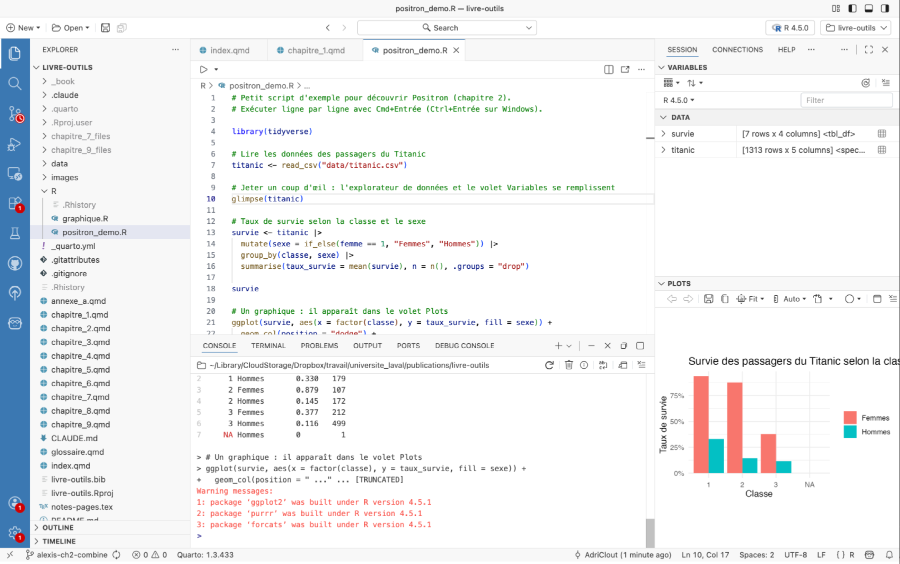

# Outils de programmation : pourquoi $\textsf{R}$, et par où commencer {#sec-chap2}

\begin{center}
\textit{Marc-Antoine Rancourt (University of Toronto), \\
Laurence-Olivier M. Foisy (Université Laval)}
\end{center}

{fig-align="center" width="12%"}

Ce chapitre n'apprend pas à programmer. D'excellentes ressources le font déjà, gratuitement et en français, et nous y renvoyons à la fin. Son rôle est de mettre la table. Il explique ce qu'est la programmation, pourquoi un chercheur en sciences sociales gagne à s'y mettre et pourquoi, parmi tous les langages, nous avons choisi $\textsf{R}$. Il installe ensuite un environnement de travail moderne, `Positron`, et montre comment s'y retrouver. Il se termine sur la question que tout le monde se pose maintenant, soit quoi faire de l'intelligence artificielle quand on écrit du code. Le marteau de la boîte à outils, c'est ici. On le retrouvera à chaque étape du livre, pour collecter des données, les transformer, les analyser et les présenter. Mieux vaut savoir le tenir avant de commencer.

## Point d'observation : qu'est-ce que la programmation ?

La programmation est une manière de donner des instructions à un ordinateur pour qu’il exécute des tâches précises.
On utilise pour cela des langages de programmation.
Ces langages ont des règles beaucoup plus strictes que les langues traditionnelles comme le français ou l’anglais.
Chaque ligne (ou phrase) doit être claire et respecter une syntaxe définie pour que l’ordinateur comprenne.
Une simple erreur de syntaxe comme l'oubli d'une virgule ou une faute de frappe peut empêcher un programme de fonctionner correctement.

Un langage de programmation sert d’intermédiaire entre l’humain et la machine.
Il permet de traduire des idées ou des méthodes en une suite d’opérations exécutables.
On peut ainsi automatiser des calculs statistiques, transformer et visualiser des données, ou développer des applications.

Il existe différents niveaux de langages.
Les langages de haut niveau, comme $\textsf{R}$, `Python` ou `Java`, sont conçus pour être lisibles et expressifs.
Ils sont faciles à comprendre et se rapprochent du langage naturel.
Ils permettent de se concentrer sur la logique et les objectifs de l'analyse, sans gérer les détails techniques du matériel.
On peut dire qu'un langage de haut niveau ressemble à la conduite d'une voiture : on se concentre sur la direction à prendre, et la mécanique interne se gère toute seule.
Ce sont les langages les plus couramment utilisés en sciences sociales.

Les langages de bas niveau, comme l'assembleur, se rapprochent du langage machine.
Pour reprendre l'image de la voiture, c'est comme travailler directement sous le capot, en réglant soi-même chaque mécanisme pour obtenir un contrôle maximal.
Cet avantage s'accompagne toutefois d'une contrepartie : ces langages sont plus difficiles à apprendre et restent rarement utilisés en sciences sociales.

Chaque langage possède des domaines d’application privilégiés.
$\textsf{R}$ est largement utilisé pour les statistiques et la visualisation.
`Python` est polyvalent et sert autant pour l’analyse de données que pour l’intelligence artificielle ou le développement d’applications.
`SQL` est spécialisé dans les bases de données.
`HTML` et `CSS` structurent et stylisent des pages web.
`C` et `Rust` sont réputés pour leurs performances dans des systèmes complexes.
Cette diversité reflète l’évolution des besoins et permet de choisir l’outil le mieux adapté à un projet donné.

Apprendre à programmer ne se résume pas à mémoriser une syntaxe.
Il s'agit aussi d'acquérir une manière de raisonner logique, structurée et reproductible.
Ces compétences sont utiles pour travailler avec des données, mais aussi pour résoudre des problèmes dans d’autres contextes.
Aujourd’hui, la programmation est une compétence fondamentale en sciences sociales, car elle permet d’automatiser des tâches, d’analyser des données à grande échelle et de partager des résultats de façon transparente.

## Arpentage et choix éditorial : quel langage apprendre ?

Pour choisir quel langage de programmation apprendre, il faut d'abord considérer ses objectifs personnels et professionnels.
Bien que la majorité des principaux langages de programmation puissent aujourd'hui réaliser une grande variété de tâches, ils ont tous leurs spécialités et leurs avantages.
Si l'objectif est de développer des sites web, `JavaScript` est incontournable, tandis que `HTML` et `CSS` constitueront les bases de la conception web.
Pour ceux qui s'intéressent à l'analyse de données ou à la recherche scientifique, `Python` ou $\textsf{R}$ représentent d'excellents choix grâce à leurs nombreuses librairies spécialisées.
`Julia` peut être intéressant pour faire de la science des données et de l'apprentissage machine.
L'apprentissage d'un langage de programmation demande une certaine quantité d'efforts et de temps.
Il est recommandé de commencer son apprentissage avec des langages tels que `Python` et $\textsf{R}$ en raison de leur syntaxe claire et intuitive qui ressemble au langage naturel.
En effet, cela permet au programmeur débutant de se concentrer sur les concepts fondamentaux de la programmation, tels que les variables, les boucles et les fonctions, sans être découragé par une syntaxe complexe.
L'environnement d'apprentissage et les ressources disponibles en ligne jouent également un rôle important dans le choix d'un langage de programmation.
`Python` et $\textsf{R}$ ont des communautés très actives en plus d'une grande quantité de documentation et d'innombrables tutoriels gratuits, permettant l'apprentissage autonome et efficace.
Les ressources pour apprendre sont abondantes, nous y revenons à la fin du chapitre, et les assistants d'intelligence artificielle changent aussi la donne, dans un sens comme dans l'autre.

Contrairement aux langages de programmation précédemment mentionnés, dont le code source est ouvert, il existe des logiciels propriétaires comme *SAS*, *STATA*, *Excel* et *SPSS*.
Ces logiciels présentent plusieurs avantages spécifiques qui peuvent justifier leur choix par rapport aux langages de programmation généralistes.
L'accessibilité et la facilité d'utilisation constituent l'argument principal en leur faveur.
Les logiciels propriétaires peuvent être installés et utilisés rapidement.
Ils se distinguent des langages de programmation par leur interface graphique intuitive, qui permet de réaliser rapidement des analyses statistiques complexes.
Cette approche dite du *point-and-click* élimine pour plusieurs utilisateurs la barrière d'entrée technique.
De plus, elle permet aux chercheurs de se concentrer sur l'interprétation des résultats plutôt que sur l'apprentissage de la programmation.
Ceci est particulièrement utile pour des utilisateurs occasionnels ou pour des chercheurs dans des domaines où l'analyse statistique n'est qu'un outil parmi d'autres.

### Pourquoi choisir le langage de programmation $\textsf{R}$ ?

Le langage de programmation $\textsf{R}$ présente des avantages uniques qui en font un choix pertinent pour la recherche en sciences sociales numériques.
Le principal avantage est que le code source est ouvert.
Cela signifie que le langage de programmation $\textsf{R}$ est gratuit d'utilisation et développé par les utilisateurs et non par une grande entreprise.
Cela lui procure une plus grande flexibilité et permet aux utilisateurs de modifier le langage pour répondre à leurs besoins spécifiques.
Le nombre d'utilisateurs est d'ailleurs en croissance importante depuis plusieurs années.
Pour les institutions académiques, les startups ou les organisations à budget limité, le langage de programmation $\textsf{R}$ permet d'accéder à des capacités d'analyse de niveau professionnel sans investissement financier important.
Cette gratuité ne se limite pas aux coûts d'achat de licence.
Elle s'étend à l'ensemble de l'écosystème $\textsf{R}$, notamment à l'accès à la formation, à la documentation et aux différentes fonctionnalités.
Les extensions (souvent appelées *packages*) sont des groupes de fonctionnalités créés et utilisés par les usagers du langage de programmation $\textsf{R}$ afin d'étendre les possibilités offertes de base.
De nouveaux *packages* comportant notamment de nouvelles méthodes statistiques et de visualisations graphiques sont constamment ajoutés et améliorés.
Ainsi, le développement du langage se fait de manière décentralisée et toute personne sachant programmer en $\textsf{R}$ peut collaborer à cette communauté.
Les *packages* sont regroupés sur le *Comprehensive R Archive Network* (CRAN) (voir <https://cran.r-project.org/> pour plus d'informations).
Bien que le site ait une politique de dépôt stricte et que les *packages* doivent être suffisamment documentés, il n'y a pas d'autorité décisionnelle centrale.

Cette richesse de l'écosystème signifie que pratiquement toutes les techniques et méthodes statistiques, des plus classiques aux plus récentes, sont disponibles et utilisables dans $\textsf{R}$.
Il est souvent dit que $\textsf{R}$ est un langage de programmation développé par des statisticiens, pour des statisticiens.
Qui plus est, les différents *packages* sont généralement très « clés en main », ce qui est avantageux pour les programmeurs débutants.
Ils sont aussi souvent bâtis sur des fondations communes permettant également aux programmeurs plus avancés de personnaliser et d'adapter leur code aux besoins de leurs analyses.
Les caractéristiques du langage de programmation $\textsf{R}$ permettent aussi la réplicabilité des résultats, même lorsqu'il y a des changements de version ou de nouvelles fonctions.
Ce n'est pas toujours le cas avec les logiciels propriétaires qui changent parfois certaines fonctionnalités entre les versions.
Les logiciels propriétaires sont souvent coûteux, rigides et l'ajout de fonctionnalités se fait par les développeurs internes à la compagnie.
Ces formalités rendent le processus plus lent et réduisent l'éventail des possibilités pour l'utilisateur.
Le fait que *SAS* et *SPSS* permettent à leurs utilisateurs d'intégrer des éléments de programmation $\textsf{R}$ à leurs logiciels est un indicateur fort de l'utilité de $\textsf{R}$ pour tous.

Bien entendu, il existe un constant débat en sciences sociales numériques sur le langage de programmation le plus approprié à apprendre et à enseigner.
<!-- Comme discuté ci-dessus, apprendre le langage de programmation R a de nombreux avantages. --> <!-- Toutefois, certains notent que le langage de programmation R peut avoir des inconvénients. --> <!-- La courbe d'apprentissage peut être plus grande que celle de logiciels à licence. --> <!-- Bien que l'apprentissage de ces logiciels aient aussi un coût d'entrée, ils peuvent apparaître être plus intuitifs et facile d'accès. --> <!-- Le développement en source ouverte, spécifiquement celui du langage de programmation R, peut sembler se faire de façon anarchique. -->

<!-- Considérant les avantages et les inconvénients sur langage de programmation R, certains chercheurs en sciences sociales numériques préfèrent d'autres langages de programmation tels que Python et Julia. -->

`Python` est un langage de programmation considéré comme plus généraliste qui permet de développer des applications web, des logiciels et des modèles d'apprentissage machine et d'intelligence artificielle.
Sa syntaxe est considérée par certains comme étant plus intuitive et proche du langage naturel, en plus de bénéficier d'une communauté d'utilisateurs plus vaste et diversifiée que $\textsf{R}$.
De plus, dans certains domaines, le marché de l'emploi offre plus d'opportunités pour les utilisateurs de `Python`.
Toutefois, il n'est pas aussi performant que $\textsf{R}$ pour l'analyse et la visualisation de données.
Pour sa part, `Julia` est avantageux pour des calculs intensifs ou de la modélisation mathématique.
En fait, `Julia` est conçu pour être aussi rapide que `C` ou `Fortran` tout en restant aussi simple que `Python`.
Le langage a été créé dès le départ pour le calcul haute performance et la recherche scientifique moderne.
Toutefois, `Julia` reste moins populaire que $\textsf{R}$, avec moins de *packages* spécialisés, surtout pour les analyses statistiques.
Bien que pertinent et important, le débat sur le choix d'un langage de programmation est sans fin.
Il n'y a pas de réponse définitive et objective à savoir quel langage de programmation un chercheur en sciences sociales numériques devrait apprendre.
Le choix dépend des objectifs spécifiques propres à chacun.
Cependant, considérant les tâches à effectuer et la communauté de chercheurs travaillant déjà en $\textsf{R}$, apprendre le langage de programmation $\textsf{R}$ est un excellent choix.

```{r}
#| tbl-cap: Résumé des principaux outils de programmation
#| echo: false
#| message: false
#| warning: false

library(tidyverse)
library(gt)

tbl_resume_chap_prog <- tibble(
  Critères = c(
    "Accessibilité",
    "Existence d'une communauté d'utilisateurs",
    "Popularité en sciences sociales",
    "Compatibilité avec d'autres outils",
    "Transparence et réplicabilité",
    "Adaptabilité et flexibilité"
  ),
  `Logiciels propriétaires (SAS, SPSS, STATA)` = c(
    "Dispendieux", "Grande", "De moins en moins populaires",
    "Demande un peu d'ajustement", "Faible", "Peu flexible"
  ),
  Python = c(
    "Gratuit", "Très grande", "De plus en plus populaire",
    "Facilement compatible", "Excellent", "Très flexible"
  ),
  Julia = c(
    "Gratuit", "En croissance", "Peu populaire",
    "Demande un peu d'ajustement", "Bonne", "Très flexible"
  ),
  R = c(
    "Gratuit", "Très grande",
    "Très populaire",
    "Facilement compatible", "Excellent", "Très flexible"
  )
)

tbl_resume_chap_prog |>
  gt() |>
  # Légende du tableau
  tab_caption("Résumé des principaux outils de programmation pour l’analyse de données") |>
  # Libellés de colonnes (avec saut de ligne dans l’en-tête long)
  cols_label(
    Critères = "Critères",
    `Logiciels propriétaires (SAS, SPSS, STATA)` = md("Logiciels propriétaires (*SAS*, *SPSS*, *STATA*)"),
    Python = md("`Python`"),
    Julia = md("`Julia`"),
    R = "R"
  ) |>
  # Alignements + largeurs
  cols_align("left", columns = everything()) |>
  cols_width(
    Critères ~ pct(32),
    `Logiciels propriétaires (SAS, SPSS, STATA)` ~ pct(17),
    Python ~ pct(17),
    Julia ~ pct(17),
    R ~ pct(17)
  ) |> 
  # Style “booktabs” + entêtes en gras
  tab_style(
    style = list(cell_text(weight = "bold")),
    locations = cells_column_labels(everything())
  ) |>
  opt_table_lines() |>
  # Typo / espacement (mêmes réglages que ton modèle)
  tab_options(
    table.font.size = px(12),
    data_row.padding = px(11),
    column_labels.background.color = "white",
    table.width = pct(95)
  )
```

### Une brève histoire du langage de programmation $\textsf{R}$

L'histoire du langage de programmation $\textsf{R}$ s'inscrit dans une évolution constante des besoins et des méthodes en sciences sociales.
Avant l'ère numérique, l'analyse de données se faisait principalement à la main ou à l’aide de calculatrices mécaniques, avec des méthodes statistiques standardisées, mais limitées par la capacité humaine à traiter des volumes massifs d’informations.
Ces contraintes ont poussé les chercheurs à chercher des moyens plus efficaces de manipuler les données, ce qui a ouvert la voie à l’ère informatique et aux premiers logiciels dédiés à la statistique.
Dans les années 1960 et 1970, les premiers langages et logiciels statistiques, tels que *SPSS* (1968), *SAS* (1976), *STATA* (1985) et *Excel* (1985) ont vu le jour.
Ces outils permettaient aux chercheurs d’automatiser les calculs statistiques complexes sur des ordinateurs de grande taille, en accélérant considérablement les analyses.
Ces logiciels propriétaires ont joué un rôle crucial dans la standardisation de l’analyse statistique en sciences sociales, en offrant des plateformes robustes, mais souvent coûteuses et rigides.

L’émergence du logiciel libre dans les années 1990 a influencé le domaine de la statistique.
C’est dans ce contexte que le langage $\textsf{R}$ a été créé, en 1993, par Ross Ihaka et Robert Gentleman, à l’Université d’Auckland, en Nouvelle-Zélande.
$\textsf{R}$ est basé sur le langage de programmation `S`, développé chez *Bell Labs* à la fin des années 1970.
Contrairement à ses prédécesseurs propriétaires, $\textsf{R}$ a été conçu pour être gratuit, flexible et extensible, ce qui en a fait un outil populaire parmi les chercheurs qui désiraient personnaliser leurs analyses tout en ayant accès à des ressources communautaires.
Les créateurs du langage de programmation `S` --- et ceux de $\textsf{R}$ par extension --- ne viennent pas du milieu de la programmation classique.
En effet, l'objectif à la base de ces langages était de rendre plus facile et accessible l'analyse de données.
Le langage de programmation $\textsf{R}$ a répondu à des besoins pressants de la communauté scientifique de l'époque : pouvoir accéder à des outils puissants sans avoir à payer des licences onéreuses et bénéficier d’une liberté totale dans le développement de nouvelles méthodes d’analyse.
Grâce à sa structure ouverte, $\textsf{R}$ a rapidement évolué grâce aux contributions de statisticiens et de programmeurs du monde entier, devenant l’un des langages de programmation les plus populaires pour l’analyse de données.
Aujourd’hui, il est largement utilisé non seulement en sciences sociales, mais aussi en biostatistique, en économie et en science des données.
Avec l'émergence des mégadonnées et de la science des données, le langage de programmation $\textsf{R}$ est incontournable.
Des entreprises telles que *Posit* (anciennement *RStudio*) développent des outils intégrés qui rendent $\textsf{R}$ plus accessible et qui permettent d'aller encore plus loin, poussant les limites d'un langage souvent perçu comme étant principalement utilisé pour l'analyse de données.
L'écosystème $\textsf{R}$ se diversifie avec des *packages* comme `ggplot2` (servant à la visualisation graphique), `dplyr` (servant à la manipulation et au traitement de données), ou `Shiny` (qui permet de faire des applications web interactives).

L’évolution des langages de programmation, notamment le langage de programmation $\textsf{R}$, illustre comment les besoins des chercheurs en termes de flexibilité, d’accessibilité et de partage ont façonné les outils que nous utilisons aujourd’hui.
Au fil des décennies, les langages se sont adaptés aux nouvelles méthodes et à l’augmentation des capacités de calcul, offrant des possibilités toujours plus larges pour l’exploration et l’analyse de données.

## Manuel d'instruction : s'installer et faire ses premiers pas

### Où coder en $\textsf{R}$ ?

La programmation peut se faire de différentes façons, mais un point commun entre tous les langages est la nécessité pour l'utilisateur de communiquer avec son ordinateur.
Cette communication peut se faire par le terminal ou directement dans l'éditeur R.
Elle peut aussi se faire dans un environnement de développement intégré (IDE).
Les IDE permettent aux programmeurs de centraliser les différents aspects de l'écriture d'un programme informatique.
Ils permettent de réaliser toutes les activités courantes d'un programmeur --- l'édition du code, la construction des exécutables et le débogage --- au même endroit.
Les environnements de développement intégrés sont conçus pour maximiser la productivité des programmeurs.
L'utilisation d'un IDE n'est pas obligatoire, mais elle facilite la tâche des programmeurs, surtout pour les utilisateurs débutants.
Ils fournissent de nombreuses fonctionnalités, notamment la coloration syntaxique (le surlignage des éléments du code) et le contrôle de version, pour créer, modifier et compiler du code.
Certains environnements de développement intégré sont dédiés à un langage de programmation spécifique.
Par conséquent, ils contiennent des fonctionnalités qui sont plus adaptées aux paradigmes de programmation du langage auquel ils sont associés.
Enfin, il existe de nombreux environnements de développement intégré multilingues qui peuvent notamment comprendre le langage de programmation $\textsf{R}$, mais aussi le langage de balisage \LaTeX, le langage de programmation `Python`, etc.

Comme mentionné précédemment, $\textsf{R}$ est l'un des langages les plus populaires en sciences sociales numériques, et de nombreux environnements le prennent en charge.
Pendant plus de dix ans, `RStudio` a été l'environnement de référence, et beaucoup de chercheurs l'utilisent encore.
Depuis 2025, son concepteur, l'entreprise *Posit*, concentre ses nouveautés dans `Positron`, un environnement conçu pour $\textsf{R}$ et `Python`.
C'est celui que nous présentons dans ce livre et que nous utilisons dans nos cours.
D'autres environnements plus généralistes, comme `Visual Studio Code`, prennent en charge $\textsf{R}$ par des extensions.

Deux téléchargements suffisent pour commencer.
D'abord $\textsf{R}$ lui-même, sur le site du CRAN (<https://cran.r-project.org>), en choisissant son système d'exploitation.
Ensuite `Positron`, sur le site de *Posit* (<https://positron.posit.co/download.html>).
`Positron` reconnaît l'installation de $\textsf{R}$ au premier démarrage.

### Qu'est-ce que Positron ?

`Positron` est un environnement de développement intégré créé par *Posit*, l'entreprise derrière `RStudio`, `Quarto` et le `tidyverse`.
Il est gratuit, fonctionne sur *Windows*, *macOS* et *Linux*, et prend en charge $\textsf{R}$ et `Python` sur un pied d'égalité.
Il est construit sur `Code OSS`, la base libre de `Visual Studio Code`, ce qui lui donne un éditeur moderne et l'accès à des milliers d'extensions.
*Posit* y a ajouté ce qui manque à un éditeur généraliste pour faire de l'analyse de données.
Une console $\textsf{R}$ intégrée, un volet qui montre les objets en mémoire, un explorateur de données pour feuilleter une base comme une feuille de calcul, un volet pour les graphiques et un autre pour l'aide.

Sa licence mérite une phrase.
`Positron` est gratuit et son code est consultable, mais il est distribué sous l'*Elastic License*, qui en restreint la modification et la redistribution, alors que `RStudio` reste un logiciel libre au sens du @sec-chap1.
C'est un compromis que nous assumons, pour les raisons pratiques exposées dans les critères de sélection.

### Pourquoi Positron ?

Nous avons enseigné $\textsf{R}$ avec `RStudio` pendant des années, et il fait encore très bien le travail.
Trois raisons nous ont fait changer.
D'abord, *Posit* recommande maintenant `Positron` à quiconque commence et y réserve ses nouveautés, `RStudio` n'étant plus qu'entretenu.
Ensuite, `Positron` fait tourner $\textsf{R}$ à part de l'éditeur, de sorte qu'un plantage de $\textsf{R}$ ne fait généralement pas tomber tout l'environnement, et il permet de passer d'une version de $\textsf{R}$ à l'autre, ou de $\textsf{R}$ à `Python`, sans tout relancer.
Enfin, il a été conçu pour les assistants d'intelligence artificielle, dont nous parlons plus loin.
Un lecteur qui connaît déjà `RStudio` n'a rien à désapprendre.
L'organisation en volets est la même et les fichiers sont les mêmes.
Celui qui préfère y rester peut suivre ce livre sans problème.

### Comment utiliser Positron ?

`Positron` s'ouvre sur une fenêtre en quatre zones, proche de celle de `RStudio`.
À gauche, une barre d'activité et l'explorateur de fichiers, qui montre le contenu du dossier de travail.
Au centre, l'éditeur, où l'on écrit ses scripts et ses documents `Quarto`.
Sous l'éditeur, la console, où $\textsf{R}$ exécute le code et affiche les résultats, et un terminal pour parler directement à l'ordinateur.
À droite, le volet *Session*, avec les variables en haut, c'est-à-dire les bases de données, les vecteurs et les fonctions en mémoire, et les graphiques en bas.
Un clic sur une base de données dans les variables ouvre l'explorateur de données, qui permet de la feuilleter, de la trier et de la filtrer sans écrire une ligne.

Pour exécuter du code, on place le curseur sur une ligne de son script et on appuie sur Cmd+Entrée sur *macOS*, ou Ctrl+Entrée sur *Windows* et *Linux*.
La ligne part dans la console, le résultat s'affiche et les objets créés apparaissent dans les variables.
On peut aussi sélectionner plusieurs lignes et les exécuter d'un coup.
Le script `positron_demo.R`, dans le dossier `R` du dépôt du livre, fait le tour de ces volets en quelques lignes avec les données du Titanic (@fig-positron).

{#fig-positron fig-align="center" width="100%"}

Deux habitudes valent la peine dès le début.
Ouvrir un dossier plutôt qu'un fichier, pour que tous les chemins d'accès partent du bon endroit.
Et garder son code dans un script, pas seulement dans la console, pour pouvoir le relancer, le relire et le partager.
La palette de commandes, Cmd+Maj+P ou Ctrl+Maj+P, donne accès à tout le reste, y compris l'installation d'extensions, par exemple pour le contrôle de version présenté au @sec-chap4, ou pour l'assistant d'intelligence artificielle.

### Programmer avec l'intelligence artificielle : le codage par instinct

Depuis quelques années, on n'écrit plus du code seul.
Les assistants comme *Claude*, *ChatGPT* ou *Copilot* proposent des lignes, expliquent une erreur, traduisent une idée en fonction $\textsf{R}$ en quelques secondes.
En 2025, Andrej Karpathy a donné un nom à la version extrême de cette pratique, le *vibe coding*, qu'on peut traduire par codage par instinct[^chapitre_2-1].
On décrit ce qu'on veut, on accepte ce que la machine propose, on relance quand ça ne marche pas, et on ne lit plus vraiment le code.
Pour un prototype du dimanche, pourquoi pas.
Pour la recherche, c'est un problème.

[^chapitre_2-1]: Expression lancée par Andrej Karpathy en février 2025 sur le réseau X.

La raison tient en un mot, la validation.
Un résultat scientifique vaut ce que vaut le code qui l'a produit, et un code que personne ne comprend ne peut être ni vérifié ni reproduit.
Les études sur le sujet convergent.
Les programmeurs qui s'appuient sur un assistant produisent plus souvent du code fautif, tout en étant plus convaincus de sa qualité [@perry_etal23].
Des développeurs expérimentés qui se croyaient plus rapides avec l'IA se sont révélés plus lents une fois mesurés [@becker_etal25].
Déléguer sa réflexion à un assistant laisse aussi des traces, une forme de dette cognitive que l'on paie quand vient le moment de comprendre par soi-même [@kosmyna_etal25a].
En science, le risque va plus loin que le code.
L'IA donne facilement l'impression de comprendre un phénomène qu'on n'a pas vraiment étudié [@messeri_crockett24].

Il existe pourtant une bonne façon de faire, et elle ressemble à ce que ce livre défend depuis le prélude.
L'IA amplifie un chercheur compétent, elle ne le remplace pas.
Concrètement, cela veut dire travailler par petits pas, une fonction ou un bloc à la fois, plutôt que de demander un script complet.
Lire chaque proposition et n'accepter que ce que l'on comprend.
Demander à l'assistant d'expliquer une ligne obscure avant de l'utiliser, c'est d'ailleurs l'un de ses meilleurs usages.
Vérifier les résultats sur un petit exemple dont on connaît la réponse.
Garder ses données sensibles hors des services en ligne.
Et se rappeler que l'assistant a lu des millions de scripts, mais pas nos données ni notre question de recherche.

Dans `Positron`, ces assistants s'intègrent directement à l'environnement.
Depuis l'été 2026, `Positron` est livré avec son propre assistant, que l'on branche sur le fournisseur de son choix, *Anthropic* pour *Claude*, *OpenAI* ou *GitHub Copilot*, avec sa propre clé d'accès.
On peut aussi installer *Claude* comme extension, comme dans `Visual Studio Code`.
L'assistant a accès au script ouvert et au contexte de la session, ce qui rend ses réponses bien plus justes qu'un copier-coller dans une fenêtre de clavardage.
Bien utilisé, il accélère le travail, aide à déboguer, suggère des façons de faire que l'on ne connaissait pas et oblige à formuler clairement ce que l'on cherche.
Mal utilisé, il produit vite beaucoup de code que personne ne relira.
La différence entre les deux ne tient pas à l'outil.
Elle tient à la personne qui le tient.
Le @sec-chap9 revient en détail sur les usages de l'intelligence artificielle en recherche.

### Apprendre R pour vrai

Reste à apprendre le langage lui-même, et ce n'est pas l'affaire d'un chapitre.
Deux ressources gratuites suffisent pour commencer et pour aller loin.
En français, *Introduction à R et au tidyverse* de Julien Barnier [-@barnier24] est un livre en ligne complet, clair et tenu à jour, qui part de zéro.
En anglais, *R for Data Science* [@wickham_etal23], écrit par les concepteurs du `tidyverse`, est la référence de toute la communauté, lui aussi accessible gratuitement en ligne.
Les deux se lisent avec `Positron` ouvert à côté, en tapant les exemples soi-même.
Des plateformes comme *DataCamp* ou *Codecademy* offrent une structure plus scolaire, contre abonnement.
Pour les questions qui bloquent, la communauté est là, sur des forums comme *Stack Overflow* ou *Posit Community*.
Le meilleur conseil reste le plus simple.
Prendre ses propres données, se poser une vraie question et chercher comment y répondre.
On apprend un langage en s'en servant.

## En terminant

Le langage de programmation $\textsf{R}$ est un outil très utile pour toutes sortes de tâches, notamment liées aux statistiques et à la visualisation graphique.
Sa maîtrise est requise pour accéder à plusieurs emplois, tant dans le monde académique que dans les secteurs public et privé.
$\textsf{R}$ ne s'utilise pas obligatoirement avec `Positron`, mais pour la plupart des lecteurs, le duo est le bon point de départ, et il ouvre la porte aux langages de balisage et aux outils des chapitres suivants.
Quant à l'intelligence artificielle, elle rend l'apprentissage plus rapide et plus agréable, à une condition, celle de rester la personne qui comprend le code.
L'apprentissage du langage de programmation $\textsf{R}$ apparaît comme une valeur sûre.
Sa longévité dans plusieurs domaines ainsi que la forte croissance de sa base d'utilisateurs laissent présager que connaître au moins les bases de $\textsf{R}$ constitue un énorme avantage.
Pour ceux qui sont particulièrement intéressés par le langage de programmation $\textsf{R}$ et qui souhaitent s'impliquer dans sa communauté, il existe plusieurs conférences internationales et nationales sur $\textsf{R}$ --- notamment *RConference* et *useR!* --- ainsi qu'un journal académique, *The R Journal*.
On retrouve également différentes communautés, telles que *R-Ladies*, qui mettent de l'avant la diversité des genres dans la communauté du langage de programmation $\textsf{R}$.
Le langage de programmation $\textsf{R}$ est plus qu'un simple outil statistique, il est au centre d'une grande communauté de personnes qui ont à cœur des principes liés à l'inclusion et à l'avancement de la science.

\pagesdenotes
