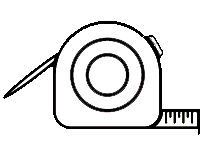
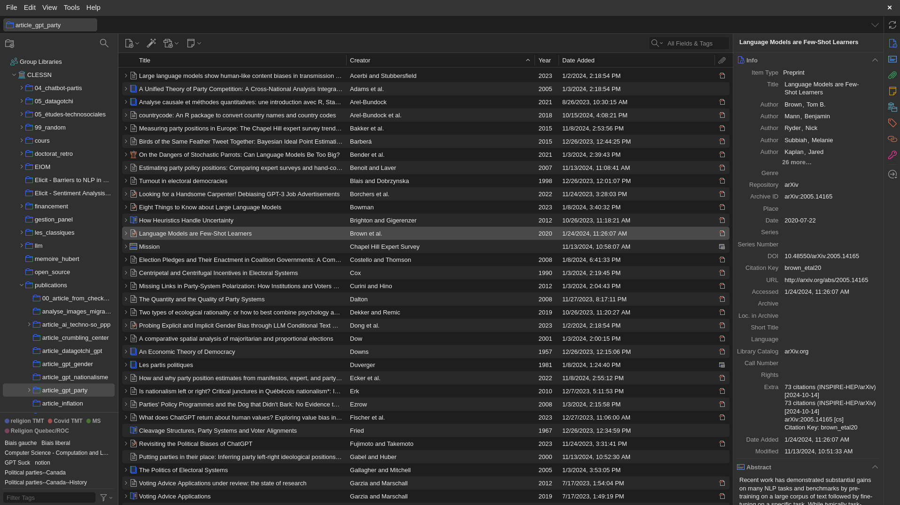

# Outils de synthèse de la connaissance et de gestion des références : pour une revue de littérature rigoureuse et publiable {#sec-chap5}

\begin{center}
\textit{Camille Pelletier (Université Laval), \\
Laurence-Olivier M. Foisy (Université Laval)}
\end{center}

{fig-align="center" width="12%"}

La revue de littérature passe souvent pour une formalité, l'étape qu'on expédie avant de commencer la vraie recherche. C'est une erreur de perspective. Bien conduite, elle est une contribution scientifique en soi. Elle délimite un champ, montre ce qui a déjà été tenté, fait apparaître les questions que personne n'a encore posées, et justifie l'étude qui va suivre.

Ce qui la rend scientifique tient à sa méthode plutôt qu'au nombre de textes lus. Une revue solide documente comment les études ont été trouvées, selon quels critères elles ont été retenues ou écartées, et comment elles ont été analysées. La revue rapide, la revue de portée et la revue systématique répondent chacune à cette exigence à leur façon. Ces méthodes s'enseignent à l'université et leurs résultats se publient.

Une revue tient aussi par la façon dont ses sources sont gérées. Citer situe le travail dans un cadre existant, permet à d'autres de refaire le chemin et rend à chacun ce qui lui revient [@zaid_etal17; @hughes13]. Quand les références se comptent par centaines, les tenir en ordre devient autant une affaire d'outil que de méthode.

Ce chapitre ne remplace pas la formation à la revue systématique, que les bibliothèques universitaires offrent déjà. Il présente les méthodes qui existent, explique pourquoi elles comptent, et introduit deux outils qui aident à les appliquer, *Covidence* pour la sélection des études et *Zotero* pour les références.

## Point d'observation : la connaissance et les références

Les synthèses de la connaissance ainsi que la gestion des références ont longtemps été des processus fastidieux, nécessitant une organisation rigoureuse des références, des notes de lecture et des articles accumulés au fil du temps. Avant l’avènement des outils numériques, les chercheurs dépendaient de méthodes manuelles pour organiser leur documentation. Les bibliographies étaient construites à la main ou à l'aide de logiciels de traitement de texte et les articles scientifiques étaient souvent archivés en version papier dans des classeurs. Cette gestion physique de la littérature et des références était laborieuse, sujette aux erreurs et difficile à partager avec d'autres chercheurs ou collaborateurs.

Le développement des technologies de l'information et la montée en puissance des bases de données en ligne ont ouvert la voie à l'émergence d'outils numériques de synthèse de la connaissance et de gestion des références. À mesure que les ordinateurs devenaient plus accessibles et que l'informatique évoluait, de nouvelles possibilités se sont offertes pour organiser et gérer la littérature de manière plus efficace. C’est dans ce contexte que les premiers outils numériques de synthèse de la connaissance et de gestion des références ont vu le jour.

Ces logiciels de première génération, tels que *EndNote* (1988) et *Bookends* (1988), répondaient à un besoin pressant, faciliter l’organisation des références ainsi que leur insertion automatique dans des documents, tout en générant des bibliographies conformes à différents standards éditoriaux. Cependant, ces outils se sont rapidement sophistiqués à travers les années. Les logiciels de gestion de références sont devenus des plateformes centralisées permettant aux chercheurs de stocker des milliers de citations, de les classer par mots-clés ou thématiques et de les retrouver facilement. Les utilisateurs pouvaient aussi importer des références directement depuis des bases de données en ligne comme PubMed ou JSTOR, automatisant encore davantage le processus. Aujourd’hui, les outils de synthèse de la connaissance et de gestion des références, tels que *Zotero* (2006), *Mendeley* (2008) ou *Covidence* (2014), permettent non seulement de gérer des bibliographies, mais également de collaborer à plusieurs sur des revues systématiques, d’annoter des articles, d’organiser des données et de générer des rapports structurés. Leurs fonctionnalités *cloud* facilitent également la synchronisation entre différents appareils et assurent un accès en tout lieu.

Bien que ce chapitre aborde à la fois les outils de synthèse de la connaissance et de gestion des références, il est essentiel de préciser que ces deux types d'outils ont des utilités et fonctionnalités distinctes. D'une part, les outils de synthèse de la connaissance, comme *Covidence*, *Colandr* et *Rayyan*, sont conçus pour gérer des processus de recherche plus complexes, tels que les revues systématiques, en facilitant la sélection, l'évaluation critique et la synthèse des études. D'autre part, les outils de gestion des références, tels que *EndNote* et *Zotero*, se concentrent sur l'organisation, l'annotation et la création de bibliographies à partir de références.

{#fig-cycle-recherche width="80%" fig-align="center"}

Avant d'entrer dans les outils, il convient de glisser quelques mots sur les méthodes pour lesquelles ces outils sont utiles. Dans le cadre de l'élaboration d'une recherche scientifique, la phase de synthèse de la connaissance constitue une étape fondamentale permettant de circonscrire le champ d'étude, d'identifier les travaux antérieurs pertinents et de déceler les lacunes dans les connaissances existantes (@fig-cycle-recherche). Parmi ces approches, la revue narrative est de loin la plus répandue. Le chercheur y rassemble les travaux qu'il juge pertinents et en propose une lecture d'ensemble, sans règle explicite sur la façon dont il les a trouvés ni sur ceux qu'il a écartés. C'est la forme qu'on rencontre dans l'introduction d'un mémoire ou d'un article, et elle convient très bien pour situer un travail dans son champ. Sa limite est qu'elle ne se reproduit pas, puisque personne ne peut refaire la même sélection à partir de ce qui est écrit. Les outils fondés sur l'intelligence artificielle sont d'ailleurs utiles dans ce contexte, car ils élargissent la portée de la lecture en proposant des références liées aux travaux déjà identifiés.

La réalisation d’une revue de littérature rigoureuse suit un *pipeline* structuré qui comprend plusieurs étapes distinctes, chacune soutenue par des outils spécifiques. On peut schématiquement distinguer : la définition de la question de recherche, la recherche et découverte des sources, l’organisation des références, l’analyse et la synthèse des contenus, et la rédaction. À chaque étape correspondent des outils adaptés : des assistants comme *Elicit*, *Consensus* ou *Connected Papers* pour la découverte ; *Zotero* pour l’organisation ; *NotebookLM* ou *Scholarcy* pour la compréhension rapide des contenus ; et des outils comme *Covidence* pour structurer et documenter la sélection des études dans le cadre d’une méthode systématique.

Ce chapitre ne couvre pas l’ensemble de ce *pipeline*. Les outils de découverte assistée par intelligence artificielle sont utiles, mais leur évolution rapide les rend difficiles à présenter de manière pérenne. Nous avons choisi de concentrer le propos sur ce qui reste vrai d’une année à l’autre, la méthode et la gestion des sources, parce que c’est de là que vient la valeur scientifique d’une synthèse.

Les méthodes plus formelles se distinguent de la revue narrative par le protocole qu'elles imposent. La revue de portée, ou *scoping review*, représente une approche systématique et structurée de revue de la littérature. Elle est principalement utilisée afin d'explorer des questions de recherche étendues ou complexes. Son objectif fondamental est de cartographier l'état actuel des connaissances sur un sujet donné, en identifiant les concepts clés, les principaux domaines de recherche ainsi que les lacunes existantes dans un domaine d'étude spécifique [@munn_etal18]. Cette méthode se distingue par son champ d'application large et son objectif exploratoire, permettant ainsi une compréhension holistique des thématiques étudiées.

La revue de portée, comme toute synthèse systématique, suit un protocole structuré en six étapes [@munn_etal18] : (1) planifier le projet et définir la question de recherche ; (2) repérer les études pertinentes dans les bases de données ; (3) sélectionner les références selon des critères d'inclusion et d'exclusion explicites ; (4) extraire les données pertinentes de chaque étude retenue ; (5) analyser et synthétiser les données ; (6) finaliser et diffuser les résultats. La revue systématique suit le même protocole, mais va plus loin en évaluant rigoureusement la qualité méthodologique de chaque étude retenue. C'est la transparence de ce protocole (appliqué de manière identique quelle que soit l'équipe qui le réalise) qui fait de ces méthodes des contributions scientifiques publiables à part entière.

Ce protocole gagne à être enregistré avant le début du tri, dans un registre comme *PROSPERO* pour les revues en santé ou sur l'*Open Science Framework* présenté au @sec-chap4. L'enregistrement date les intentions et rend visible tout écart ultérieur, exactement comme la préinscription d'une étude empirique.

La deuxième étape, celle du repérage des études, est souvent celle où les chercheurs se sentent le moins outillés. Personne n'est expert en tout, et c'est justement le travail des bibliothécaires-conseils, qui accompagnent la construction des critères et de la stratégie de recherche dans la plupart des universités. Il vaut mieux les consulter au début du projet, avant que le tri ne soit entamé.

Repérer les études demande de choisir les bases de données à interroger, comme *Web of Science*, *Scopus* ou *Érudit* pour la production francophone. Il faut ensuite traduire sa question en mots-clés et en descripteurs, chaque base ayant son propre vocabulaire contrôlé, puis combiner ces termes avec des opérateurs booléens. L'équation ainsi construite, la liste des bases interrogées et la date de l'interrogation font partie de ce qui doit être consigné, au même titre que les résultats obtenus. Sans ces informations, un lecteur ne peut pas refaire la recherche. Il faut aussi décider si l'on inclut la littérature grise, c'est-à-dire les thèses, les rapports et les actes de conférence qui ne figurent pas dans les bases classiques et dont l'omission peut fausser le portrait obtenu.

À la recherche par mots-clés dans les bases de données s'ajoute le *snowballing*, qui n'est pas un type de revue mais une technique de repérage utilisable dans chacune d'elles. Elle se fonde sur la sélection initiale de quelques publications clés dans le champ d'intérêt. Par la suite, le chercheur identifie de manière itérative d'autres travaux pertinents en examinant les références citées (*backward snowballing*) ou les articles citant ces travaux (*forward snowballing*) [@wohlin14]. Elle est particulièrement utile dans les phases préliminaires, quand la question d'étude n'est pas encore entièrement définie. Cette approche n'est pas un pis-aller. Combinée à une recherche par base de données, elle permet d'identifier des études qu'aucune des deux méthodes ne trouve seule [@wohlin_etal22].

Le protocole d'une revue de portée ou d'une revue systématique s'accompagne généralement d'un diagramme de flux *PRISMA* (*Preferred Reporting Items for Systematic reviews and Meta-Analyses*), qui documente de manière transparente le nombre d'études identifiées, filtrées, évaluées et finalement retenues à chaque étape. Ce standard international est exigé par la plupart des revues scientifiques qui publient des synthèses systématiques, et constitue en lui-même une garantie de reproductibilité.

Dans le domaine des sciences sociales, les revues systématiques et les méta-analyses offrent aussi des outils précieux pour synthétiser et évaluer de manière rigoureuse les preuves issues de multiples études. Ces approches permettent de dégager des tendances, d'identifier des consensus ou des divergences dans la littérature et d'éclairer les débats politiques et sociaux grâce à une base de données empirique solide. En recensant de manière exhaustive et méthodique la littérature existante sur un sujet donné, les chercheurs peuvent offrir une synthèse objective qui reflète l'état actuel des connaissances. La méta-analyse, souvent intégrée dans le cadre d'une revue systématique, va plus loin en combinant quantitativement les résultats de différentes études pour produire une estimation globale de l'effet étudié. Elle offre ainsi une puissance statistique accrue et une meilleure généralisation des conclusions, transcendant les limites des études individuelles.

Les synthèses de la connaissance ont longtemps été davantage associées aux sciences naturelles et à la santé, où les revues systématiques et les méta-analyses constituent des publications de premier plan. Les sciences sociales en produisent aujourd’hui de plus en plus, et leur valeur scientifique y est pleinement reconnue. Pour un étudiant à la maîtrise ou au doctorat qui réalise un mémoire ou une thèse par articles, la revue systématique constitue une première étude particulièrement pertinente. Elle évite également de réinventer la roue : avant de collecter de nouvelles données, il est essentiel de savoir ce qui existe déjà, ce qui a été tenté et ce qui a échoué. Elle permet aussi de cartographier rigoureusement un champ de recherche : identifier les auteurs clés, repérer les méthodes sous-représentées, dégager les grandes théories en présence et mettre en lumière les questions encore en suspens. Ce faisant, elle constitue une contribution scientifique solide, publiable dans de bonnes revues et susceptible d’être citée. Les études suivantes du mémoire ou de la thèse peuvent alors s’appuyer sur ce portrait rigoureux pour s’inscrire précisément dans les lacunes identifiées et apporter une contribution empirique ciblée. Nous encourageons vivement les étudiants à considérer la revue systématique non pas comme un exercice préliminaire, mais comme une première étude à part entière qui pose les fondements d’un programme de recherche. Il convient cependant de reconnaître que la revue systématique n'est pas toujours la bonne approche. Elle demande des mois et, le plus souvent, une équipe. Quand le temps manque, la revue rapide (*rapid review*) offre un compromis. Elle applique la même méthode en la restreignant volontairement, par exemple en interrogeant moins de bases ou en limitant la période couverte, et elle dit exactement ce qu'elle a restreint. Le besoin d'un simple portrait d'ensemble, lui, justifie une revue narrative. L'important est que ce choix soit conscient et explicite.

## Arpentage et choix éditorial : les outils de synthèse de la connaissance

Plusieurs outils existent afin de faciliter la vie des chercheurs qui souhaitent effectuer des synthèses de la connaissance, chacun répondant à des besoins spécifiques. *Covidence*, *Colandr* et *Rayyan* sont trois outils populaires dans le monde académique, offrant chacun des fonctions similaires. *Covidence* est surtout utilisé pour les revues systématiques, particulièrement dans les domaines de la santé, mais il est également adaptable aux sciences sociales. Il se distingue par son interface conviviale, sa gestion collaborative efficace, et son intégration avec des outils comme *EndNote* et *Zotero*. Il est payant, ce qui peut être un frein pour certains utilisateurs, mais de nombreux établissements d'enseignement ont une licence institutionnelle. Il est généralement l'outil privilégié par les bibliothèques universitaires. *Colandr*, quant à lui, est un outil gratuit et à code source ouvert qui se distingue par l’utilisation de l’intelligence artificielle pour optimiser la sélection des études et automatiser certaines tâches. Il est particulièrement adapté aux projets interdisciplinaires, notamment dans les domaines de l’environnement ou des politiques publiques. Son interface est moins intuitive que celle de *Covidence*, mais il reste un excellent choix pour ceux qui cherchent un outil gratuit et collaboratif. Finalement, *Rayyan* est un autre outil répandu pour les revues systématiques, y compris en sciences sociales. Il offre une interface intuitive et des algorithmes facilitant le tri des articles, mais son accès gratuit est limité (trois revues actives) et certaines fonctions utiles à une revue systématique, comme la génération du diagramme *PRISMA*, sont réservées aux formules payantes. Il propose en outre moins d'options pour l’extraction des données en comparaison à *Covidence*. *Covidence* et *Rayyan* sont tous deux des logiciels propriétaires, alors que *Colandr* est le seul des trois dont le code est ouvert.

### Choix éditorial : pourquoi *Covidence* ?

L'outil de synthèse de la connaissance *Covidence* permet une avancée majeure dans la pratique des revues systématiques, en offrant des fonctionnalités qui optimisent chaque étape du processus de recherche. Sa capacité à importer et organiser efficacement les références provenant de diverses bases de données bibliographiques permet une gestion structurée des articles à inclure dans une revue. Cet outil facilite également la collaboration, en permettant à plusieurs chercheurs de travailler simultanément sur un même projet. En automatisant les premières phases de sélection des articles, il réduit la charge de travail manuel et limite les biais potentiels. De plus, ses moyens d'extraction de données et d'évaluation de la qualité assurent une analyse rigoureuse et cohérente des résultats. Enfin, son intégration avec d'autres plateformes de recherche en renforce la compatibilité et l'efficacité. En rendant chaque étape du processus traçable et documentée, *Covidence* est l'outil qui traduit concrètement l'exigence de rigueur et de transparence au cœur des méthodes de synthèse systématique.

Bien que *Covidence* soit développé par une organisation à but non lucratif, il ne répond pas pleinement aux critères du logiciel libre, car son code source n'est pas accessible pour modification ou redistribution par la communauté. Cette limitation peut freiner les utilisateurs souhaitant personnaliser l'outil en fonction de besoins spécifiques. Néanmoins, *Covidence* propose un modèle de licence adapté à un usage académique et non commercial, rendant l'outil accessible à une large communauté de chercheurs. L'une de ses principales forces réside dans son intégration des données issues de multiples bases bibliographiques, ce qui simplifie considérablement le processus de revue systématique. *Covidence* est également compatible avec des outils de gestion des références comme *EndNote* et *Zotero*, facilitant l'importation et l'organisation des références. De nombreuses institutions universitaires soutiennent l'outil, offrant des licences institutionnelles pour en élargir l'accès.

En outre, l'interface intuitive de *Covidence* réduit la courbe d'apprentissage, guidant les utilisateurs à travers les différentes phases de la revue systématique de manière structurée et simplifiée par rapport aux méthodes traditionnelles. Ses fonctionnalités de double codage, de filtrage et d'extraction de données garantissent une méthodologie rigoureuse et standardisée, indispensable pour assurer la qualité des revues systématiques. De plus, *Covidence* excelle dans la facilitation de la collaboration entre chercheurs. La plateforme permet à plusieurs utilisateurs de travailler simultanément sur un même projet, d'échanger sur l'inclusion ou l'exclusion d'études, et de résoudre efficacement les divergences, ce qui s'avère particulièrement précieux pour les projets de grande envergure impliquant des équipes dispersées géographiquement.

Cependant, l'utilisation de *Covidence* présente certaines contraintes. Le coût de l'abonnement peut constituer un frein pour certains chercheurs. De plus, bien que *Covidence* propose des modèles standards pour l'extraction de données et l'évaluation de la qualité, ces derniers peuvent ne pas convenir à tous les types d'études, en particulier celles nécessitant une personnalisation plus poussée. Malgré ces défis, *Covidence* demeure un atout précieux pour la réalisation de revues systématiques, bien qu'il soit essentiel de peser soigneusement ses avantages et inconvénients en fonction des besoins spécifiques de chaque projet de recherche.

Ce coût soulève une question légitime dans un ouvrage qui privilégie les outils libres et gratuits. Pourquoi, dès lors, recommander un outil payant ? Deux raisons motivent ce choix. D'abord, *Covidence* est devenu un standard dans les bibliothèques universitaires, qui sont nombreuses à le soutenir et à le rendre accessible gratuitement à leurs membres au moyen d'une licence institutionnelle. Ensuite, sa longévité. Soutenu de façon stable depuis 2014, il offre une pérennité que peu d'outils du domaine garantissent. Notre recommandation est donc conditionnelle. Lorsqu'un établissement met *Covidence* à la disposition de ses membres sans frais, il y a tout intérêt à l'utiliser ; dans le cas contraire, plutôt que de souscrire un abonnement personnel, mieux vaut se tourner vers une solution de logiciel libre comme *Colandr*.

```{r}
#| tbl-cap: Résumé des principaux outils de gestion de la connaissance
#| echo: false
#| message: false
#| warning: false

library(tidyverse)
library(gt)

tbl_resume_chap_5_connaissance <- tibble(
  Critères = c(
    "Accessibilité",
    "Existence d'une communauté d'utilisateurs",
    "Popularité en sciences sociales",
    "Compatibilité avec d'autres outils",
    "Transparence et réplicabilité",
    "Adaptabilité et flexibilité"
  ),
  Covidence = c(
    "Dispendieux",
    "Grande",
    "Très populaire",
    "Facilement compatible",
    "Bonne",
    "Plutôt flexible"
  ),
  Colandr = c(
    "Gratuit",
    "En croissance",
    "En croissance",
    "Facilement compatible",
    "Excellente",
    "Très flexible"
  ),
  Rayyan = c(
    "Gratuit (limité)",
    "Grande",
    "Populaire",
    "Facilement compatible",
    "Bonne",
    "Plutôt flexible"
  )
)

tbl_resume_chap_5_connaissance |>
  gt() |>
  tab_caption("Résumé des principaux outils de gestion de la connaissance") |>
  cols_label(
    Critères = "Critères",
    Covidence = "Covidence",
    Colandr = "Colandr",
    Rayyan = "Rayyan"
  ) |>
  cols_align("left", columns = everything()) |>
  cols_width(
    Critères ~ pct(32),
    Covidence ~ pct(23),
    Colandr ~ pct(23),
    Rayyan ~ pct(22)
  ) |>
  tab_style(
    style = list(cell_text(weight = "bold")),
    locations = cells_column_labels(everything())
  ) |>
  opt_table_lines() |>
  tab_options(
    table.font.size = px(12),
    data_row.padding = px(11),
    column_labels.background.color = "white",
    table.width = pct(95)
  )
```

## Manuel d'instruction : comment utiliser *Covidence*

Reconnu pour ses trois phases méthodiques (« Title and abstract screening », « Full text review » et « Extraction »), *Covidence* facilite l'importation de données volumineuses depuis des bases de données bibliographiques et interroge plusieurs bibliothèques. Cela offre un accès à des milliers d'études pertinentes qui aident les chercheurs à élaborer un cadre théorique exhaustif. Comme mentionné dans la section précédente, les méthodes justifiant une utilisation de *Covidence* impliquent généralement un double codage. Deux personnes évaluent chaque étude séparément, sans voir la décision de l'autre, et *Covidence* ne révèle les désaccords qu'une fois les deux votes enregistrés. Cette façon de faire limite l'effet des préférences individuelles sur la sélection, ce qu'un tri mené par une seule personne ne permet pas de vérifier. Le niveau d'accord entre les deux évaluateurs peut d'ailleurs être mesuré et rapporté dans l'article final.

La première phase, le « Title and abstract screening », consiste à examiner les titres et résumés des articles récupérés. Pour optimiser cette tâche, il est crucial de définir des critères précis afin d'évaluer la pertinence des articles relativement au sujet étudié. Durant cette étape, souvent prolongée en raison du volume conséquent de la littérature, les chercheurs doivent régulièrement se consulter pour résoudre les divergences d'opinions et parvenir à un consensus.

Après la révision des titres et des résumés vient le « Full text review ». Cette deuxième phase implique l'examen complet des textes sélectionnés lors de l'étape précédente. Les chercheurs doivent alors voter « oui », « non », ou « peut-être » afin de décider de la conservation des textes, ce qui peut inclure ou exclure un article ou le faire progresser vers l'étape suivante. Cette phase, bien qu'elle concerne moins de documents, reste exigeante et chronophage, principalement en raison des délibérations nécessaires pour résoudre les divergences de points de vue.

La phase finale, celle de l'extraction des données, implique la collecte d'informations pertinentes des études finalement retenues, fondée sur un schéma de codification prédéfini. L'objectif est de parvenir à un consensus parmi les codeurs. L'extraction dévoile les cadres théoriques, les méthodologies employées ainsi que les conclusions principales des recherches sélectionnées.

Une fois les étapes de la revue systématique achevées, la plateforme *Covidence* facilite l'exportation des données extraites sous forme de tableaux, de graphiques et de rapports, destinés à être utilisés dans des analyses subséquentes ou dans la rédaction d'articles scientifiques. La maîtrise de *Covidence* couvre ainsi la dimension méthodologique de la synthèse de la connaissance. Une fois les études sélectionnées et analysées, la gestion rigoureuse des références bibliographiques devient l'étape suivante incontournable, et c'est là qu'intervient *Zotero*.

## Arpentage et choix éditorial : les outils de gestion des références

Dans le domaine des outils de gestion des références, *Mendeley* et *EndNote* sont deux solutions populaires utilisées par les étudiants et les chercheurs à travers le monde. Bien que similaires dans leurs fonctions principales, ils se distinguent par plusieurs aspects qui influencent le choix des utilisateurs en fonction de leurs besoins spécifiques.

*Mendeley*, développé par *Elsevier*, est un logiciel gratuit avec des options payantes pour étendre l’espace de stockage en ligne. Il se caractérise par son réseau social intégré, permettant aux utilisateurs de partager leurs références et de collaborer avec d’autres chercheurs. *Mendeley* offre également une fonction d’annotation de documents PDF, un gestionnaire de citations, ainsi qu’une application de bureau et mobile. Toutefois, *Mendeley* est parfois critiqué pour sa dépendance vis-à-vis d’un service centralisé et pour ses politiques de confidentialité, liées à son appartenance à la compagnie *Elsevier*.

*EndNote*, quant à lui, est un logiciel commercial développé par *Clarivate*. *EndNote* se distingue par ses nombreuses fonctionnalités pour la gestion de grandes bibliothèques de références, une compatibilité avancée avec les styles de citations et une intégration fluide avec *Microsoft Word*. Il est souvent préféré dans les environnements académiques qui exigent des références complexes ou un large nombre de sources. Cependant, son coût d’acquisition élevé et l'absence d'une communauté à code source ouvert active peuvent être des freins pour certains utilisateurs, notamment ceux qui privilégient l’accès à des outils gratuits ou collaboratifs.

### Choix éditorial : pourquoi *Zotero* ?

Dans l'écosystème des outils de gestion bibliographique, plusieurs solutions s'offrent aux chercheurs. Bien que chacune présente ses propres avantages, notre choix s'est porté sur *Zotero* pour des raisons à la fois techniques, économiques et méthodologiques que nous détaillons ci-après. *Zotero* se distingue des autres outils de gestion des références par sa gratuité et son accessibilité en tant que logiciel libre, avec un code ouvert largement soutenu par une communauté active sur *GitHub*, qui compte plus de 13 000 contributions. Ce logiciel propose une vaste gamme de fonctionnalités et permet l'ajout d'extensions pour enrichir son utilisation, ce qui le rend particulièrement puissant tout en restant facile à utiliser. *Zotero* est compatible avec diverses plateformes, notamment Windows, Mac, Linux, iOS et Android, facilitant ainsi la collaboration entre les membres d'une équipe de recherche qui utilisent différents systèmes. La bibliothèque *Zotero* peut être synchronisée sur plusieurs appareils via le service *cloud* payant de *Zotero* ou en configurant un espace de stockage *cloud* personnel. Ce logiciel s'intègre parfaitement dans les projets de recherche utilisant \LaTeX{} ou Quarto, permettant d'exporter des fichiers `.bib` et de les intégrer facilement dans un flux de travail de rédaction scientifique. De plus, *Zotero* fonctionne avec des logiciels de traitement de texte tels que *LibreOffice* et *Microsoft Office*, et offre la possibilité de créer des bibliographies et des citations dans plus de 9 000 styles de citation différents, répondant ainsi aux divers besoins des chercheurs. En outre, il permet d'ajouter directement les documents PDF des références et d'y prendre des notes, ce qui simplifie considérablement la centralisation de l'information pertinente pour la recherche. Dans le contexte d'une revue systématique, cette centralisation est particulièrement précieuse, puisqu'elle garantit que chaque référence retenue ou écartée est traçable, organisée et partageable avec les autres membres de l'équipe de recherche.

*Zotero* offre l'avantage significatif de centraliser les sources bibliographiques et les fichiers associés, simplifiant grandement le partage de documents au sein des équipes de recherche. Avec *Zotero*, il est possible d'ajouter des PDF et de les synchroniser dans des groupes de travail, ce qui élimine le besoin de recourir à des dossiers partagés ou d'envoyer des documents par courriel ou via des plateformes de partage de fichiers. Cette centralisation permet également de réaliser des recherches par mot-clé à travers l'ensemble des sources d'une bibliothèque, facilitant la récupération rapide de sources spécifiques.

Cependant, *Zotero* présente également quelques inconvénients, notamment sa gestion parfois difficile de très grandes bibliothèques contenant des milliers de fichiers, ce qui peut nécessiter l'achat d'espace de stockage supplémentaire. Bien que performant, le logiciel requiert parfois la saisie manuelle d'informations que le connecteur intégré ne détecte pas automatiquement, représentant un potentiel défi pour les utilisateurs. Ces quelques défis soulignent l'importance d'évaluer les besoins spécifiques en matière de gestion bibliographique avant de choisir *Zotero* comme solution.

Le @sec-chap8 présente le langage de balisage \LaTeX. Un des avantages majeurs de *Zotero* réside justement dans sa capacité à s'intégrer parfaitement avec \LaTeX{}. *Zotero* permet nativement de gérer les clés de citation et d'exporter des bibliographies au format BibLaTeX vers un fichier `.bib`. (Pour les projets nécessitant une synchronisation continue et automatique du fichier `.bib`, l'extension Better BibTeX reste une option complémentaire utile.) BibLaTeX, une extension moderne pour gérer les bibliographies dans \LaTeX{} et Quarto, s'utilise couramment avec Biber, un outil de traitement bibliographique avancé compatible avec BibLaTeX. Biber propose des fonctionnalités telles que le tri poussé, la gestion de multiples bibliographies et le traitement de divers formats de données bibliographiques. BibLaTeX, prenant en charge de nombreuses langues, est idéal pour la rédaction de documents destinés à un public international. Il est recommandé de maintenir dans le fichier `.bib` uniquement les références utilisées, organisées par ordre alphabétique, afin de faciliter la collaboration et le partage des ressources.

```{r}
#| tbl-cap: Résumé des principaux outils de gestion des références
#| echo: false
#| message: false
#| warning: false

library(tidyverse)
library(gt)

tbl_resume_chap_5_references <- tibble(
  Critères = c(
    "Accessibilité",
    "Existence d'une communauté d'utilisateurs",
    "Popularité en sciences sociales",
    "Compatibilité avec d'autres outils",
    "Transparence et réplicabilité",
    "Adaptabilité et flexibilité"
  ),
  Zotero = c(
    "Gratuit",
    "Très grande",
    "Très populaire",
    "Facilement compatible",
    "Excellente",
    "Très flexible"
  ),
  Mendeley = c(
    "Gratuit",
    "Grande",
    "Très populaire",
    "Facilement compatible",
    "Bonne",
    "Plutôt flexible"
  ),
  EndNote = c(
    "Dispendieux",
    "Grande",
    "Populaire",
    "Facilement compatible",
    "Faible",
    "Peu flexible"
  )
)

tbl_resume_chap_5_references |>
  gt() |>
  tab_caption("Résumé des principaux outils de gestion des références") |>
  cols_label(
    Critères = "Critères",
    Zotero = "Zotero",
    Mendeley = "Mendeley",
    EndNote = "EndNote"
  ) |>
  cols_align("left", columns = everything()) |>
  cols_width(
    Critères ~ pct(32),
    Zotero ~ pct(23),
    Mendeley ~ pct(23),
    EndNote ~ pct(22)
  ) |>
  tab_style(
    style = list(cell_text(weight = "bold")),
    locations = cells_column_labels(everything())
  ) |>
  opt_table_lines() |>
  tab_options(
    table.font.size = px(12),
    data_row.padding = px(11),
    column_labels.background.color = "white",
    table.width = pct(95)
  )
```

## Manuel d'instruction : comment utiliser *Zotero*

### Installation et configuration

L'intégration de *Zotero* dans le processus de recherche académique permet une gestion structurée et efficace des références bibliographiques. Les étapes suivantes décrivent l'installation, la configuration et les principales fonctions de l'outil.

L'installation de *Zotero* commence par le téléchargement de l'application *Zotero* ainsi que de son extension pour navigateur, *Zotero* Connector. Cette extension permet de capturer facilement des références à partir de sources en ligne. Une fois l'installation terminée, il est recommandé de créer un compte *Zotero* via le lien d'inscription. Ce compte facilite la synchronisation des données entre différents appareils et permet le partage de bibliothèques de références avec des collaborateurs.

{#fig-interface-zotero width="80%" fig-align="center"}

La configuration initiale est essentielle pour exploiter pleinement *Zotero* dans un cadre de collaboration. Les chercheurs peuvent créer et rejoindre des bibliothèques partagées, ce qui permet une gestion collective des références dans des projets communs.

### Ajouter des références à *Zotero*

*Zotero* offre plusieurs méthodes pour ajouter des références à une bibliothèque :

-   Glisser-déposer : L'utilisateur peut importer des documents, tels que des PDF, directement dans la bibliothèque *Zotero*. *Zotero* tente automatiquement de récupérer les métadonnées associées. En cas d'échec, l'outil « Baguette magique » permet de saisir manuellement les informations requises.

-   Utilisation de l'outil Baguette magique : Lorsque des identifiants uniques tels que DOI ou ISBN sont disponibles, *Zotero* extrait automatiquement les métadonnées complètes de la référence. Si les informations ne sont pas trouvées, l'utilisateur a la possibilité de compléter manuellement les champs nécessaires.

-   *Zotero* Connector : Cet outil capture les références directement depuis le navigateur, en les classant automatiquement dans les collections de la bibliothèque *Zotero*. Cela permet une gestion instantanée des articles scientifiques et autres ressources en ligne.

### Gestion des clés de citation et export `.bib`

*Zotero* gère nativement les clés de citation, ce qui permet de citer des références directement dans un document \LaTeX{} ou Quarto sans extension *Zotero* tierce. Les clés sont générées automatiquement à partir des métadonnées de chaque référence et peuvent être consultées et modifiées directement dans l'interface de *Zotero*.

Pour les projets collaboratifs qui nécessitent une synchronisation continue du fichier `.bib`, l'extension Better BibTeX offre des fonctionnalités complémentaires. Pour l'installer, il faut accéder au menu des modules complémentaires (via le menu `Outils` sur Windows/Linux ou le menu `*Zotero*` sur macOS, puis `Modules complémentaires`), sélectionner l'option Installer un module à partir d'un fichier et choisir le fichier `.xpi` préalablement téléchargé. Une fois l'installation terminée, il convient de configurer le module via les préférences de *Zotero* (menu `Édition > Préférences` sur Windows/Linux ou `*Zotero* > Préférences` sur macOS) dans l'onglet Better BibTeX.

### Génération du fichier `.bib`

Pour exporter une collection *Zotero* au format BibLaTeX, il suffit de faire un clic droit sur la collection souhaitée et de sélectionner `Exporter la collection`, puis de choisir le format `BibLaTeX`. Cette méthode native est suffisante pour la grande majorité des usages. Pour les projets partagés via des systèmes de versionnement comme *GitHub*, Better BibTeX offre une option supplémentaire. En choisissant le format `Better BibLaTeX` et en cochant `[x] Keep updated`, le fichier `.bib` sera mis à jour automatiquement chaque fois que de nouvelles références seront ajoutées à *Zotero*.

Il est important de noter que toute modification effectuée dans *Zotero* (ajout, suppression de références) sera automatiquement synchronisée avec les autres membres du groupe. Cela implique qu'une gestion prudente des références est nécessaire pour éviter toute suppression accidentelle.

### Utilisation de *Zotero* lors de la rédaction

Lors de la rédaction d'articles scientifiques, *Zotero* peut être intégré directement dans des éditeurs de texte compatibles avec \LaTeX{} ou Markdown. L'insertion de références se fait simplement en utilisant la commande `@` dans l'éditeur de texte, permettant de sélectionner rapidement la référence souhaitée à partir de la bibliothèque *Zotero*.

## En terminant

Ce chapitre a défendu l'idée que la revue de littérature est une démarche scientifique à part entière. Ce qui la distingue d'une simple recension, c'est qu'un autre chercheur pourrait refaire le chemin à partir de ce qui a été écrit.

*Covidence* et *Zotero* sont les outils qui soutiennent cette démarche. L'un structure et rend transparente la sélection des études, l'autre garde les références en ordre et facilite la collaboration. Leur maîtrise est un investissement dont les bénéfices dépassent largement un seul projet.

\pagesdenotes
