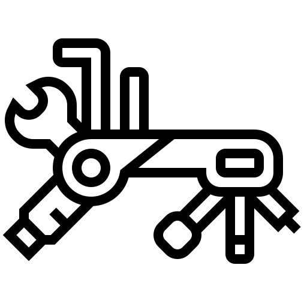

# Outils d'intelligence artificielle {#sec-chap9}

\begin{center}
\textit{Jozef Rivest (University of Michigan), \\
Laurence-Olivier M. Foisy (Université Laval), \\
Hubert Cadieux (Université Laval)}
\end{center}

{fig-align="center" width="12%"}

Avec l'arrivée de l'intelligence artificielle, les questions suivantes se posent : pourquoi un livre d'outils numériques à l'ère de l'intelligence artificielle (IA)&nbsp;? Que devient le chercheur&nbsp;? Bien évidemment, ces deux questions ne sont que la pointe de l'iceberg, mais dans le contexte de ce livre, elles apparaissent centrales.

Ce chapitre vise à initier les lecteurs à ce qu'est l'IA, aux enjeux qu'elle engendre ainsi qu'à son potentiel pour les sciences sociales. Puisque l'IA est en évolution constante, présenter des outils comme le font les chapitres précédents ne serait pas d'une grande utilité. Entre l'écriture de ce chapitre et sa lecture, les outils présentés auront sûrement beaucoup changé. Par conséquent, l'approche de ce chapitre vise à fournir des clés de compréhension ainsi qu'à aiguiser le regard critique des lecteurs afin qu'ils puissent comprendre les bases du fonctionnement des modèles de langage (LLM) et développer un regard critique sur leur propre utilisation de ces outils. Se poser des questions et tenter de trouver des réponses ne peut que générer des bénéfices. Ainsi, si ce chapitre permet d'éclairer certains enjeux, ou s'il stimule davantage de questionnement, alors il aura réussi son objectif.

L'IA nécessite une certaine réflexion afin d'en faire une utilisation responsable et éthique. Comme les lecteurs l'auront remarqué, ce livre souhaite offrir des outils et des techniques afin que les lecteurs puissent optimiser leur espace et leur flux de travail. Mais que veut dire l'optimisation au juste&nbsp;? Que cherche-t-on à optimiser&nbsp;? En résumé, la réponse offerte par ce livre est d'optimiser son temps et son apprentissage. Dans cette quête d'optimisation, l'IA apparaît comme un outil qui offre des avantages intéressants. Effectivement, elle peut accomplir des tâches à une vitesse remarquable&nbsp;! Cependant, sommes-nous réellement en train d'optimiser notre apprentissage&nbsp;? La réponse à cette question est quelque peu complexe : ça dépend. L'IA peut effectivement nous aider à optimiser notre temps, mais elle peut aussi être détrimentale pour notre apprentissage.

Cet enjeu d'optimisation touche aussi à la seconde question qui est posée en début de chapitre à propos du futur du chercheur. Comme il en sera discuté plus tard dans ce chapitre, utiliser l'IA pour accomplir des tâches nouvelles, comme écrire un script de code en entier dans un langage que l'on ne connaît pas, *n'est clairement pas* optimal. Non seulement c'est une opportunité manquée d'apprendre une nouvelle chose et de diversifier ses compétences en tant que chercheur, mais aussi pour deux autres raisons. La première, et la plus importante, est que le chercheur reste imputable de ce qu'il produit. Si des erreurs s'introduisent dans les résultats de sa recherche et si ces erreurs mènent à des décisions politiques ou sociales néfastes, ce ne sera pas l'IA qui sera blâmée, mais bien le chercheur. La seconde est que des études récentes démontrent que l'utilisation de l'IA pour accomplir des tâches peut mener à une dette cognitive [@kosmyna_etal25a]. Les apprentissages que nous ne faisons pas à un certain moment risquent fortement d'avoir des conséquences négatives sur notre capacité à en apprendre davantage et à nous développer dans le futur. Il ne faut pas oublier que l'apprentissage est fortement *cumulatif*. Par conséquent, si les bases ne sont jamais apprises, alors on aura beaucoup de difficultés à progresser. Cela étant dit, l'IA reste tout de même un outil formidable, mais qui nécessite une certaine réflexion afin d'en faire une utilisation informée, responsable et qui ne nuit pas à notre développement cognitif.

Ce chapitre est divisé en trois grandes sections. Dans un premier temps, une présentation des grands modèles de langage (LLM) sera faite afin d'introduire certaines intuitions à propos du fonctionnement de l'IA agentive. À la fin de cette section, les lecteurs auront une compréhension élémentaire du fonctionnement de ces modèles ainsi que de leurs limitations. Ensuite, une brève présentation de l'évolution de l'IA dans les dernières années sera introduite afin de mettre en contexte ses développements ainsi que l'évolution rapide de la performance de ces modèles. Dans un troisième temps, nous introduirons une réflexion quant à l'optimisation de son environnement de travail avec l'IA ainsi que sur les impacts importants qu'une utilisation irréfléchie peut amener. L'objectif sera surtout de mettre en garde les lecteurs contre la dette cognitive qui se cache derrière l'utilisation de l'IA pour accomplir des tâches à notre place. Finalement, nous terminerons le chapitre avec une réflexion à propos de la place du chercheur aujourd'hui à l'ère de l'IA.

## Point d'observation : qu'est-ce que l'intelligence artificielle ?

### Définition et différents types d'IA

Qu'est-ce que l'IA ? Est-ce quelque chose d'homogène, ou s'agit-il plutôt « des intelligences artificielles »&nbsp;? Dans un premier temps, il est important de préciser que l'IA est un champ d'études [@devedzic22]. Par conséquent, il s'agit d'un ensemble d'objets, relativement vaste et en constante expansion, qui s'intéresse, à sa façon, à l'IA. Pour préciser ce propos, prenons l'exemple de la science politique. Malgré la formulation au singulier, la science politique est un grand ensemble de différents sous-champs d'études, qui ont chacun leur propre objet d'intérêt. La philosophie politique, les relations internationales, la politique comparée et l'étude de l'opinion publique, par exemple, sont tous des sous-champs qui s'intéressent, à leur façon, au phénomène politique. Dans le même sens, et compte tenu de cette pluralité de perspectives, il est important de noter qu'il n'y a pas de consensus sur la définition de l'IA [@wang19; @konig_etal22]. De plus, la rapidité du développement de ce champ rend le traçage de frontières définitionnelles plutôt difficile : comment définir, d'une manière précise et consensuelle, quelque chose qui évolue constamment [@devedzic22; @bertolini20, p. 15]&nbsp;?

Deux définitions de l’IA peuvent tout de même être retenues. La première vient de John McCarthy [-@mccarthy07, p. 2] : « Il s'agit de la science et de l'ingénierie qui consistent à créer des machines intelligentes[^chapitre_9-1], en particulier des programmes informatiques intelligents. Elle est liée à la tâche similaire consistant à utiliser des ordinateurs pour comprendre l'intelligence humaine, mais l'IA ne doit pas se limiter aux méthodes qui sont biologiquement observables. »[^chapitre_9-2]. La seconde définition provient de la compagnie IBM [-@ibm23] : « Dans sa forme la plus simple, l'IA est un domaine qui combine l'informatique et des ensembles de données robustes pour permettre la résolution de problèmes. Elle englobe également les sous-domaines de l'apprentissage automatique et de l'apprentissage profond, qui sont souvent mentionnés en conjonction avec l'IA. Ces disciplines sont composées d'algorithmes d'IA qui cherchent à créer des systèmes experts qui font des prédictions ou des classifications basées sur des données d'entrée ». Ces extraits permettent de comprendre que l'IA consiste à reproduire artificiellement certaines capacités cognitives humaines, afin de rendre les machines « intelligentes » en leur donnant la capacité de résoudre des problèmes par elles-mêmes.

[^chapitre_9-1]: Intelligence étant défini de la façon suivante : « L'intelligence est la partie informatique de la capacité à atteindre des objectifs dans le monde. On trouve différents types et degrés d'intelligence chez l'homme, chez de nombreux animaux et chez certaines machines. » [@mccarthy07, pp. 2]

[^chapitre_9-2]: Toutes les traductions ont été effectuées par le logiciel *DeepL*.

Ces définitions restent toutefois à préciser, notamment dans le champ d'application de l'IA : qu'en est-il concrètement ? Comment est-ce utilisé ? Comment ça fonctionne ? Si l’IA se distingue en plusieurs types, en faire la liste et identifier leurs différentes branches et applications possibles serait fastidieux et s'écarterait de l'objectif de ce chapitre introductif. Cependant, pour ceux désirant en savoir plus sur le sujet, les articles de McCarthy [-@mccarthy07] et de Wang et al. [-@wang_etal23], ainsi que le *Cambridge Handbook of Artificial Intelligence* [@konig_etal22] sont très riches et illustratifs.

Avant toute chose, il est important de distinguer l'IA générale (*strong*) de l'IA précise (*narrow*). La première, et la moins populaire en nombre de recherches et d'applications, cherche à développer une machine qui aurait les mêmes capacités cognitives que l'humain, non seulement en termes de résolution de problème, d'apprentissage et de planification, mais qui serait aussi dotée d'une conscience de soi [@ibm23; @konig_etal22]. La seconde est plus restrictive, se limitant à la réalisation d'un ou de plusieurs objectifs spécifiques. De ces deux visées, il y a trois principaux champs de recherche qui se penchent sur les méthodes de fonctionnement de l'IA : l'apprentissage machine (*machine learning*), les réseaux neuronaux artificiels (*artificial neural networks*) ainsi que l'apprentissage profond (*deep learning*).

L'apprentissage machine :

\begin{singlespacing} \begin{displayquote} « [...] consiste à
programmer des ordinateurs pour optimiser un critère de performance
à l'aide de données d'exemple ou d'expériences passées. Nous avons
un modèle défini jusqu'à certains paramètres, et l'apprentissage
est l'exécution d'un programme informatique pour optimiser les
paramètres du modèle à l'aide des données d'entraînement ou de
l'expérience passée » (Alpaydin et Bach, 2014, p. 3).  \end{displayquote}
\end{singlespacing}

Le but est d'entraîner le modèle afin qu'il puisse reconnaître des tendances, et qu'il puisse décrire et/ou faire des prédictions à partir de ces tendances [@alpaydin_bach14, p. 3]. Il s'agit du champ le plus populaire dans la recherche faite sur l'IA, notamment parce qu'il constitue une base importante pour les autres recherches dans le domaine [@devedzic22].

Ensuite, un sous-champ de l'apprentissage machine, l'apprentissage profond, « \[...\] fait référence à un réseau neuronal composé de plus de trois couches \[...\]. L'apprentissage en profondeur automatise une grande partie de l'extraction des caractéristiques, éliminant ainsi une partie de l'intervention humaine manuelle nécessaire et permettant l'utilisation d'ensembles de données plus importants. Il peut ingérer des données non structurées dans leur forme brute et déterminer automatiquement la hiérarchie des caractéristiques qui distinguent les différentes catégories de données les unes des autres, ne nécessitant pas d'intervention humaine. » [@ibm23]. Ainsi, l'apprentissage profond permet une certaine forme d'automatisation des tâches demandées à l'IA, en lui fournissant les capacités nécessaires d'apprendre par lui-même pour corriger et améliorer son fonctionnement. Pour ce faire, on doit développer des structures neuronales artificielles, qui s'inspirent des neurones du cerveau humain.

C'est d'ailleurs la tâche de ceux qui s'intéressent aux réseaux neuronaux artificiels : « Les réseaux neuronaux artificiels (RNA) sont constitués d'une couche de nœuds, contenant une couche d'entrée, une ou plusieurs couches cachées et une couche de sortie. Chaque nœud, ou neurone artificiel, se connecte à un autre et possède un poids et un seuil associés. Si la sortie d'un nœud individuel est supérieure à la valeur seuil spécifiée, ce nœud est activé et envoie des données à la couche suivante du réseau. Dans le cas contraire, aucune donnée n'est transmise à la couche suivante du réseau » [@ibm23a]. Ainsi, le but est de reproduire les structures cognitives humaines, afin de permettre à l'IA d'accomplir des tâches plus complexes. L'une des principales utilités de ce sous-champ est qu'il permet d'augmenter la rapidité du classement de données. La reconnaissance vocale ou d'image, par exemple, ne prend que quelques minutes grâce à cela, contrairement à plusieurs heures, lorsque fait par des humains [@ibm23a].

L'apprentissage profond et les réseaux neuronaux sont au cœur des avancements récents de l'IA et des grands modèles de langage. Bien que l'article date un peu, @lecun_etal15 offrent un excellent tour d'horizon de l'apprentissage profond et comment cette méthode a permis de faire des avancements importants dans les dernières années. La description et l'explication du fonctionnement des réseaux neuronaux demanderait beaucoup d'espace, d'autant plus que c'est un sujet plutôt technique. En ce sens, une telle tâche tombe à l'extérieur des objectifs de ce livre. Pour les lecteurs qui souhaiteraient en savoir plus, les livres de @james_etal21, @hastie_etal17 et de @goodfellow_etal16a sont d'excellentes ressources à consulter qui expliquent aussi les fondements mathématiques et statistiques derrière l'apprentissage profond.

### L'évolution constante de l'IA

Plusieurs chercheurs ont lancé des avertissements sur le développement de l'IA, notamment à cause de la rapidité de son évolution. Dans un article paru dans *The Economist*, Bengio [-@bengio23] déclare qu'il prévoyait le développement d'une IA avec des capacités similaires à celles de l'humain d'ici quelques décennies, peut-être un siècle. Depuis l'arrivée de *ChatGPT*-4, celui-ci a revu sa prédiction pour la situer entre quelques années et quelques décennies [@bengio23]. Dans les dix dernières années seulement, les systèmes de reconnaissance d'images et de langages en sont venus à dépasser les capacités humaines [@roser22]. La @fig-evolution présente cette évolution[^chapitre_9-3].

[^chapitre_9-3]: Le graphique a été reproduit à partir des données et du graphique de Our World in Data: https://ourworldindata.org/grapher/test-scores-ai-capabilities-relative-human-performance?time=1998..2023&tab=line

```{r}
#| fig-cap: "Évolution des performances de l'IA comparée aux capacités humaines. Source : Our World in Data."
#| echo: false
#| message: false
#| label: fig-evolution
#| warning: false
#| error: false
#| width: 6
#| heigth: 6

source("R/graphique.R")
ai_evolution
```

Comme on le remarque, cette évolution ne suit pas une trajectoire linéaire. Depuis 2015, la plupart de ces technologies ont évolué de manière quasi exponentielle. Cette progression fulgurante nous permet de faire quelques constats pour appréhender l'évolution future. Tout d'abord, le développement dans les capacités de l'IA permet d'accélérer de manière exponentielle le champ dans son ensemble, ce qui rend cette technologie exponentiellement plus puissante [@harari23]. L'IA est capable de se faire évoluer à une vitesse plus grande, grâce à ses capacités de traitement de données et d'améliorations automatiques, que si elle était uniquement dépendante de l'humain.

En tant que chercheur en sciences sociales, pourquoi devrait-on être préoccupé par le développement de l'IA&nbsp;? Tout d'abord, il est important de commencer à réfléchir ainsi qu'à analyser les différents impacts que l'IA a sur nos sociétés. Les avancées dans le domaine en plus de l'accessibilité à ces technologies en font de nouveaux objets d'étude qui génèrent beaucoup de questions. Harari [-@harari23] explique dans un article que la capacité de l'IA à manipuler ainsi qu'à générer du langage en fait un outil puissant qui a le potentiel d'avoir de profonds impacts sur nos civilisations. Par conséquent, l'étude des effets de l'IA sur nos sociétés devient un nouveau sujet de recherche sur lequel tous les champs des sciences sociales ont intérêt à se pencher. Présentement, il est anticipé que cette technologie puisse être utilisée pour « produire et diffuser des informations erronées et toxiques, éroder la confiance sociale et la démocratie ; surveiller, manipuler et soumettre les citoyens, en sapant les libertés individuelles et collectives ; ou créer des armes numériques ou physiques puissantes qui menacent la vie humaine » [@bremmer_suleyman23, pp. 32]. Compte tenu des conséquences potentielles que ces technologies peuvent avoir sur le monde social, tous les domaines scientifiques ont un fort incitatif à décloisonner leur savoir et leurs analyses, en plus de maximiser l'interdisciplinarité et la recherche collaborative. Une compréhension plus complète de ces changements ainsi qu'une communication de ce savoir ne pourra que générer des bénéfices pour le monde académique, social et politique.

### L'IA en sciences sociales

Bien que l'utilisation de l'IA en sciences sociales soit relativement récente, il y a déjà quelques recherches qui se sont penchées sur son utilisation dans un contexte scientifique. Tout d'abord, la recherche de Peterson et al. [-@peterson_etal21], qui s'intéresse à comprendre comment les individus prennent des décisions, utilise l'IA afin de traiter une importante quantité de données rapidement. Leur base de données est environ trente fois plus importante que celles des études précédentes. De plus, ils ont programmé différentes théories afin de vérifier laquelle correspondait le mieux aux régularités présentes dans les données. L'utilisation de l'IA dans cette recherche est très intéressante puisqu'elle permet de tester des théories existantes sur un vaste ensemble de données, qui auraient pris beaucoup plus de temps si cela avait été réalisé manuellement.

Ensuite, la recherche de Park et al. [-@park_etal23] utilise l'IA pour créer des *generative agents* qui interagissent entre eux reproduisant des comportements individuels et collectifs humains. Leur objectif est d'en faire des proxys pour étudier le comportement humain. Leur modèle prend la forme d'une simulation interactive, similaire au jeu vidéo *Sims*. Bien que ce ne soit pas encore au point, cette application de l'IA permettrait de tester des prototypes de systèmes sociaux ainsi que des théories [@park_etal23].

Similairement, la recherche de Argyle et al. [-@argyle_etal23] utilise *ChatGPT* comme proxy pour étudier l'opinion publique dans certains sous-groupes sociaux. Leur objectif est de démontrer que *ChatGPT* peut être utilisé, avec un bon niveau de confiance, pour explorer et tester des hypothèses qui seraient coûteuses. En effet, le déploiement d'un sondage est toujours une sorte de pari&nbsp;; ils sont en général relativement coûteux, et il est difficile de prévoir si les résultats obtenus seront pertinents. *ChatGPT* permettrait donc de faire un prétest afin d'améliorer et de corriger un questionnaire avant de le déployer sur des sujets humains.

Malgré ces avantages, il est important de souligner quelques limites quant à l'utilisation de l'IA en sciences sociales. La limite la plus importante est que l'IA ne remplace en aucun cas un être humain. Comme chercheurs en sciences sociales, nous dénaturerions nos disciplines si l'on se limitait à l'IA pour répondre à nos questions. Par conséquent, un test réalisé avec l'IA ne peut pas se substituer à une collecte auprès de personnes réelles, et les résultats qu'il produit demandent d'être validés autrement. Il est donc prudent, en l'état des connaissances, de réserver l'IA à des usages exploratoires. Une autre limite importante est que l'IA peut être sujette à des hallucinations [@park_etal23]. En d'autres termes, l'IA peut fabriquer des informations de toutes pièces [@weise_metz23]. Cela pose un sérieux problème quant à la fiabilité des informations générées par l'IA. C'est pour cette raison, notamment, que nous devons toujours rester vigilants. Les conséquences d'attribuer une valeur scientifique à des informations qui seraient fausses seraient graves. La science ne vise pas à construire une compréhension fictive de la réalité. Une fausse compréhension des interactions et des dynamiques sociales pourrait avoir des conséquences importantes sur le bien-être de nos sociétés. Restons vigilants.

## Arpentage et choix éditorial : l'IA à toutes les étapes de la recherche, guide pratique pour une utilisation informée de l'IA

Dans le premier chapitre de ce livre, les auteurs ont proposé d'aborder la recherche selon une certaine temporalité : avant, pendant et après. Les chapitres qui ont suivi ont tous introduit des outils numériques qui s'insèrent dans une ou plusieurs étapes de cette temporalité. L'IA est probablement l'outil le plus transversal : elle s'insère dans chacune de ces étapes. De plus, plusieurs des outils présentés précédemment ont incorporé certaines fonctionnalités d'IA. Par exemple, les interfaces de programmation comme *VS Code* offrent l'intégration de plusieurs modèles d'IA au sein de leur interface.

Cette accessibilité grandissante et l'intégration facile de plusieurs modèles différents offrent d'importants avantages. Il est notamment plus facile d'utiliser des modèles d'IA afin de régler des problèmes de programmation — pour faire du *debugging*. Sans aucun doute, il s'agit d'une fonctionnalité très utile pour aider dans le processus de recherche et à identifier des erreurs et des problèmes lorsqu'on en rencontre.

Toutefois, il faut faire preuve d'une certaine prudence. Cette section du chapitre souhaite encourager les lecteurs à ne pas devenir *dépendants* de l'IA. L'accessibilité grandissante de cet outil peut nous mener à une utilisation constante de l'IA pour achever les différentes tâches nécessaires dans le processus de la recherche. Une telle utilisation comporte plusieurs problèmes qu'il est important d'identifier et dont il faut rester conscient. Autrement, ce sont nos capacités cognitives et réflexives qui en paieront le prix, mais aussi notre profession de chercheur qui en sera transformée. 

Dans cette sous-section, nous souhaitons présenter pourquoi l'IA devrait être utilisée pour *peaufiner* des tâches que l'on est déjà capable de faire soi-même, et non pas des tâches que l'on ne saurait pas réaliser seul. 

### Dette cognitive

Le concept de dette cognitive est présenté par @kosmyna_etal25a. Dans leur recherche, ils étudient comment l'activité cérébrale est affectée par l'utilisation d'un moteur de recherche ou d'un LLM. Comparativement aux participants qui n'avaient accès à aucun support externe afin d'écrire leur texte, et qui sont d'ailleurs le groupe ayant la plus forte activité cérébrale et la plus complète, le groupe qui devait accomplir la même tâche à l'aide d'un LLM avait une réduction de près de 55\% de leur activité cérébrale. Le groupe qui avait accès à un moteur de recherche se situe entre les deux avec une diminution de 34\% d'activité cérébrale, mais où celle-ci était surtout concentrée dans les cortices visuel et occipital. En comparaison, le groupe ayant accès à un LLM avait la plus faible activité cérébrale, et ce pour l'ensemble du cerveau. Leurs résultats montrent aussi que l'utilisation d'un support externe, et notamment l'utilisation d'un LLM, affecte négativement la consolidation de la mémoire, l'efficacité de l'autosurveillance ainsi que le degré d'agentivité perçu dans la réalisation de la tâche (147). Dans la discussion de leurs résultats, les auteurs sont préoccupés par une conséquence importante de l'IA sur l'éducation : « [...] bien qu'utile pour soutenir la performance, [les outils d'IA] pourraient involontairement nuire aux processus cognitifs, à la rétention et à l'engagement authentique avec les matériaux écrits. Si les utilisateurs sont trop dépendants des outils de l'IA, ils pourraient atteindre une fluidité de surface, mais échouer à internaliser le savoir ou à ressentir un sentiment de propriété. » (148) [Traduction des auteurs]

De plus, comme l'apprentissage est un processus qui est fortement cumulatif, il est important de comprendre que si l'on souhaite développer et renforcer son jugement critique, de même que sa capacité à produire des recherches qui offrent des solutions à des problèmes, alors il est important de maîtriser son sujet d'étude. Cette maîtrise se construit dans le temps, et se renforce au travers d'un processus itératif -- ce qui demande d'investir du temps. Évidemment, plus de temps n'est pas nécessairement synonyme d'une meilleure compréhension. Apprendre demande de s'investir activement, et de ne pas être simplement passif [@bucinca_etal21].

En ce sens, une utilisation optimale de l'IA aiderait dans la gestion du temps sans pour autant nuire à notre apprentissage. Ce qui semble maximiser cet idéal serait donc d'utiliser les outils de l'IA afin de peaufiner des tâches que nous avons déjà accomplies au préalable, et non pas pour accomplir des tâches que nous n'avons pas encore accomplies ou que nous ne savons pas faire par nous-mêmes.

### Clés d'apprentissage

Dans cette sous-section, nous souhaitons suggérer des pistes de réflexions quant à l'intégration de l'IA dans le processus d'apprentissage. La sous-section précédente ne doit pas être comprise comme décourageant l'utilisation de l'IA. Au contraire, cet outil offre de puissantes solutions, et ne pas l'intégrer dans son environnement de travail serait une erreur. Apprendre à utiliser l'IA sera un acquis important. Cependant, une intégration ainsi qu'une utilisation optimale doivent être réfléchies afin *d'optimiser* l'utilité de cet outil sans pour autant nuire à son propre développement. Par optimisation, nous entendons un apprentissage maximal de la matière dans un intervalle de temps restreint. L'objectif reste, et restera, d'apprendre et de développer ses capacités de chercheur. Dans ce contexte, il est important de comprendre les stratégies d'apprentissage, entre l'actif et le passif.

Dans leur étude, @bucinca_etal21 mettent en garde contre la surutilisation de l'IA, et le danger de devenir dépendant de cet outil, notamment à cause des problèmes soulignés ci-dessus. L'enjeu tient à la façon dont on apprend : l'apprentissage actif contre l'apprentissage passif. Une surutilisation de l'IA afin d'accomplir toutes les tâches tombe dans la catégorie de l'apprentissage passif. Les recherches montrent que ces conditions sont liées à une plus faible rétention de l'information ainsi qu'à une plus faible activation cognitive [@kosmyna_etal25a]. À l'inverse, l'apprentissage actif consiste en un engagement plus élevé de la part des étudiants avec la matière. Par exemple, cela peut consister à expliquer le contenu du cours à un non-initié, à construire des *flash cards*, à lire activement les lectures d'un cours et à annoter tout au long du texte, puis à résumer dans ses mots, par exemple.^[Pour une courte liste d'apprentissage passif et l'équivalent actif, les lecteurs peuvent consulter cette page web de l'université Johns Hopkins: https://academicsupport.jhu.edu/study-aids/active-versus-passive-learning/] Bien que l'apprentissage peut sembler fastidieux, et peut mener à une impression d'avoir moins appris [@deslauriers_etal19], les études démontrent que ce sentiment est faux, et que les étudiants qui s'engagent dans un processus d'apprentissage actif performent mieux dans les examens et ont une meilleure compréhension de la matière.

Dans ce cas, utiliser l'IA pour accomplir des tâches que nous ne sommes pas capables de faire ne semble pas être optimal. La première question que l'on devrait se poser est : suis-je capable de faire cette tâche par moi-même&nbsp;? Si la réponse est non, l'IA ne devrait pas être la première ressource vers laquelle on devrait se tourner. On devrait se saisir de cette opportunité pour approfondir sa connaissance et ses capacités. En fait, l'IA serait plus optimale lorsque nous sommes déjà capables d'accomplir une tâche et que nous souhaitons optimiser une partie de cette tâche. De cette façon, on s'assure de maximiser notre propre apprentissage personnel, ce qui nous placera en meilleure position afin d'évaluer et de comprendre ce qui est produit, non seulement par l'humain mais aussi par l'IA elle-même. Ce dernier point est très important. Des études récentes démontrent que l'humain a tendance à être trop confiant dans les recommandations de l'IA et à prendre de mauvaises décisions [@jacobs_etal21]. L'information générée par l'IA doit toujours être évaluée par le chercheur. Pour faire une bonne évaluation de cette information, le chercheur doit au préalable comprendre et avoir une certaine expertise de son domaine. En ce sens, l'apport et la valeur ajoutée de l'IA arrivent *après* la connaissance, et non pas avant. Dans l'introduction de ce livre, nous avançons que : « [...] l'IA amplifie un chercheur compétent. Elle ne remplace pas les fondations. Un chercheur qui ne maîtrise pas ses outils ne sera pas libéré par l'IA. Il en sera dépendant, sans pouvoir évaluer la qualité de ce qu'elle produit. La maîtrise des outils numériques n'est pas rendue obsolète par l'intelligence artificielle. Elle est devenue la condition pour en faire un usage éclairé. » Ce constat, qui peut paraître évident, demeure tout de même essentiel.

### L'IA et la science

Pour quelles tâches devrait-on utiliser l'IA&nbsp;? Est-ce pour *produire* quelque chose de nouveau, ou est-ce plutôt pour *peaufiner*&nbsp;? La distinction ici est très importante. Dans un article paru dans la revue *Science*, plusieurs chercheurs se disent inquiets des conséquences de l'IA dans la production scientifique [@zhao26]. Ces chercheurs estiment que l'IA accélère le processus de la recherche sans nécessairement en améliorer le contenu. Elle tend à se concentrer sur les sujets les plus populaires, mais aussi à être plus hermétique entre les différentes littératures. C'est un enjeu majeur puisque selon certaines recherches, l'IA *n'innove pas*, mais tend plutôt à reproduire et complémenter des sujets qui sont déjà populaires et bien documentés [@hao_etal26]. En ce sens, l'IA produit sur ce qu'elle connaît, plutôt que sur ce qu'elle ne connaît pas. Par ailleurs, @hao_etal26 observent une tendance à la convergence : les solutions proposées se ressemblent davantage entre elles que celles produites sans assistance. Ces travaux sont récents et portent sur les modèles disponibles au moment de leur écriture, ce qui invite à les lire comme un signal à surveiller plutôt que comme une propriété définitive de la technologie.

L'utilisation de l'IA pose aussi des défis importants dans la reproduction de la science. Les résultats de @brodeur_etal26 démontrent que l'IA sous-performe comparativement aux humains dans la détection d'erreurs dans les recherches et dans la reproduction des résultats scientifiques. Bien entendu, ces résultats changeront probablement dans les prochaines années. La capacité de l'IA a déjà beaucoup évolué depuis l'arrivée de *ChatGPT* en 2022. Malgré tout, il vaut mieux faire preuve de prudence puisque les résultats des recherches peuvent avoir des impacts importants sur les décisions politiques ainsi que sur l'avancement des connaissances.

Ces résultats soulignent l'importance de la prudence dont tous les chercheurs doivent faire preuve dans l'utilisation de l'intelligence artificielle. Selon ces auteurs, l'IA atteint ses meilleures performances lorsqu'elle *complémente* le travail du chercheur, et non pas lorsqu'elle remplace celui-ci. En ce sens, une utilisation complémentaire de l'IA s'impose, dans laquelle le chercheur reste au centre des décisions, de l'interprétation, du jugement et de la gestion des échecs complexes [@brodeur_etal26].

Cela étant dit, il ne faut pas croire non plus que l'IA n'a que des aspects néfastes pour la science et pour le chercheur. Les éléments ci-haut, et la mise en garde qui est faite, concernent la production même de savoir. Or, la production est un processus qui peut être réduit en plusieurs tâches -- c'est la base de ce livre. À chacune de ces tâches, l'IA peut être un outil fort utile pour nous aider à *peaufiner* certains éléments. Bien entendu, et comme nous l'avons mentionné plus tôt, le chercheur doit veiller à ne pas devenir dépendant de l'IA. 

Dans les sous-sections suivantes, nous proposons des exemples d'utilisation de l'IA à chaque étape de la recherche qui nous apparaissent respecter le cadre d'optimisation dont il est question ici, et dans lequel le chercheur reste le principal agent dans la production, ainsi que des exemples de « bonnes » et de « mauvaises » utilisations suivant les limites de l'intégration de l'IA dans le processus de recherche.

#### Avant la recherche

Chaque recherche débute avec une idée que l'on souhaite explorer. Cette idée doit s'ancrer dans la littérature. Dans le @sec-chap5, les lecteurs ont été initiés à *Zotero* afin d'organiser leurs références bibliographiques. *Zotero* est un outil puissant qui sauve énormément de temps, d'autant plus qu'il permet de lire et d'annoter des fichiers PDF au sein même de l'application. Avant tout, il faut trouver des articles. Plusieurs moteurs de recherche spécialisés existent déjà, tels que *Google Scholar*, ou les services offerts par la plupart des bibliothèques universitaires. Certaines IA ont aussi été développées afin d'identifier des articles scientifiques, tels que *Elicit* ou *ResearchRabbit*. Nous laissons aux lecteurs l'exploration de ces deux outils.

Une fois que plusieurs sources ont été identifiées, il faut les lire et les annoter. Rappelons-nous que le processus d'apprentissage demande un engagement actif. Ainsi, utiliser l'IA pour résumer et annoter des textes constitue un engagement passif et ne permet pas au chercheur de s'engager dans son projet de recherche. De plus, si le travail de compréhension et d'analyse critique, la première étape dans l'écriture d'un projet de recherche, n'est pas fait par le chercheur, il est fort probable que tout le reste du projet sera réalisé par l'IA. Il est donc important que le chercheur fasse cette première étape lui-même.

Toutefois, là où l'IA peut être utile, c'est dans le développement d'une structure pour la revue des écrits. Une fois que le chercheur a lu les textes qu'il avait identifiés *et* qu'il a produit un brouillon de l'organisation de la revue des écrits, il peut être utile d'échanger certaines idées à propos de celle-ci avec l'IA. Cela permet de recevoir une première vague de commentaires et d'aider dans l'organisation de ses pensées. Ici, il s'agit surtout de *peaufiner* son organisation. Cela étant dit, nous encourageons fortement les lecteurs à faire les tâches d'écriture et de lecture par eux-mêmes. L'utilisation de l'IA est équivalente à l'utilisation d'un réviseur. En d'autres termes, l'IA est utile pour recevoir des commentaires. Cela peut prendre la forme de demander une note sur 10 de notre brouillon, tout en spécifiant les contraintes et qu'il s'agit d'une version préliminaire. Après avoir reçu les commentaires, c'est le chercheur qui décide et qui fait les modifications, si nécessaire.

En résumé, avant la recherche :

-   **Mauvaise utilisation.** Laisser l'IA lire et résumer les textes à la place du chercheur, ou lui faire écrire la revue des écrits. La conséquence est une dépendance pour le reste du projet et une difficulté persistante à analyser des textes scientifiques de manière critique, ce qui est une compétence de base du métier.
-   **Bonne utilisation.** Lire les textes et les résumer dans ses mots, puis faire un premier jet de la structure de la revue des écrits et se servir de l'IA comme réviseure. La conséquence est une meilleure compréhension de son sujet et un regard critique plus sûr sur la littérature.

#### Pendant la recherche

Bien évidemment, l'utilité de l'IA au sein du processus de recherche est déjà populaire. Avec l'adoption des outils de l'apprentissage machine dans les sciences sociales et du *text as data*, l'IA et les LLMs sont devenus très populaires dans les tâches de classification et d'analyse de documents [e.g. @benoit_etal26; @burnham_etal25; @heseltine_clemmvonhohenberg24; @ornstein_etal25; @tornberg25]. D'autres recherches plus récentes ont même utilisé l'IA dans des contextes d'expériences afin d'étudier comment les gens changent de croyances. 

Par exemple, dans leur expérience, @velez_liu25 demandent aux répondants d'un sondage de répondre à une question ouverte afin de mesurer le positionnement sur certains enjeux, où ces réponses étaient ensuite analysées par *ChatGPT-3* dans le but de fournir des échelles personnalisées aux répondants. D'autres se sont aussi intéressés aux performances de l'IA à fournir de l'information précise ainsi qu'à classifier des phénomènes politiques [@foisy_etal26; @m_foisy_etal26]. Ces exemples ne constituent qu'une partie des développements récents dans l'utilisation de l'IA dans les sciences sociales. Il y a encore beaucoup de tests et de recherche à propos des capacités de l'IA en tant qu'outil scientifique ou dans l'étude des biais contenu dans l'IA. 

Ici, la frontière entre *produire* et *peaufiner* est un peu plus mince. Dans plusieurs des cas mentionnés ci-haut, l'IA est utilisée pour accompagner le chercheur afin de traiter une grande quantité de texte. C'est un apport important. La plupart des outils statistiques qui sont utilisés en sciences sociales, et surtout l'inférence statistique, reposent sur des propriétés dites asymptotiques. En d'autres termes, plus l'échantillon est grand, meilleurs sont les différents outils statistiques, et plus les inférences que nous tentons de faire seront « robustes ». Une des utilités de l'IA, au-delà d'être l'outil principal de notre recherche, est de nous aider dans l'écriture et dans la correction du code pour produire nos analyses. En effet, l'IA peut être fort utile pour identifier les erreurs et nous aider lorsqu'on rencontre un problème. Toutefois, l'IA ne doit pas se substituer complètement au chercheur dans l'écriture du code. Il reste important que le chercheur soit en mesure de vérifier, et par conséquent de lire, le code qui a été généré. L'IA peut faire des erreurs&nbsp;! Malgré ces avancements, et ce que les recherches mentionné ci-haut montrent, l'IA et les nouveaux outils méthodologiques ne remplacent pas l'humain, mais le complémente [@grimmer_etal22].

L'utilisation de l'IA pendant la recherche peut prendre des formes diverses, et il est donc difficile d'offrir des recommandations complètes et définitives sur une utilisation convenable de l'IA. Toutefois, il est possible de suggérer un certain cadre. Pour faire court, le chercheur doit rester au cœur du processus de recherche et des décisions qui sont prises. Sa compréhension du contexte qu'il étudie ainsi que son jugement sont les éléments qui permettront de faire en sorte que la science fournira des réponses qui feront progresser notre compréhension du monde social [@benoit25]. L'IA raisonne et fait des prédictions à partir des données passées. En ce sens, elle peut renforcer le statu quo plutôt que de questionner les postulats qui le maintiennent en place [@benoit25].

En résumé, pendant la recherche :

-   **Mauvaise utilisation.** Confier à l'IA l'entièreté des analyses, du code statistique jusqu'à l'interprétation des résultats. Le jugement du chercheur est alors complètement évacué, alors qu'il reste imputable de ce qui est produit.
-   **Bonne utilisation.** Se servir de l'IA pour produire les données à analyser, par exemple pour classer des documents et construire un corpus. La conséquence est une meilleure compréhension des données, du contexte et des résultats.

#### Après la recherche

Une fois la recherche faite, il est temps d'écrire et de diffuser nos résultats. Ici aussi, une utilisation « responsable » de l'IA s'inscrit dans un processus actif et non passif. Généralement, la tâche d'écriture est plus facile à la fin de la recherche, lorsque le chercheur maîtrise son sujet et est resté l'agent principal dans la conception du devis de recherche et dans la production des résultats. En ce sens, l'IA peut être utile afin de revoir, d'évaluer et de faire des suggestions sur ce que le chercheur a produit. Mais le chercheur doit rester au centre des décisions et évaluer si les recommandations faites par l'IA sont utiles et ne dérogent pas du propos et de l'argument qu'il souhaite faire.

En somme, cette sous-section souhaitait présenter certaines clés de réflexion aux lecteurs afin qu'ils puissent situer l'IA dans chacune des étapes de la recherche en fonction des enjeux d'apprentissage et de transparence dont il a été question plus tôt. Ce chapitre ne souhaite pas décourager les lecteurs d'utiliser l'IA, bien au contraire. Il est important de développer ses compétences dans l'utilisation de l'IA et de savoir comment écrire des *prompts* qui permettent de maximiser le retour des agents conversationnels, par exemple. Ce sont de nouvelles compétences qui doivent être développées et comprises par les chercheurs. Cependant, il est aussi très important de comprendre les limites et les enjeux derrière une utilisation qui mène à une dépendance envers l'IA, et de comprendre qu'au-delà des coûts personnels au niveau de l'apprentissage, il y a aussi des coûts collectifs dans la production d'une science plus transparente et qui ne fait pas seulement « re-mâcher » ce qui a été produit au préalable. Oui, l'IA est un outil puissant qui offrent des capacités utiles pour la production scientifique, mais elle a aussi son coût et ses défis&nbsp;: elle peut nuire au processus scientifique, à l'avancement des connaissances et aux prises des décisions publiques.

## En terminant

Avec l'avènement de l'IA, il est tout à fait raisonnable de se demander quelle est la place du chercheur aujourd'hui. L'avenir du chercheur est-il en danger&nbsp;? Pourrait-on assister au développement des sciences sociales sans chercheur humain&nbsp;? Si tel est le cas, est-ce que ça ne constituerait pas un paradoxe important&nbsp;? Est-ce que la machine est mieux placée pour comprendre la réalité du monde sociale, ainsi que ses mécanismes, que l'humain&nbsp;? D'une part, certains pensent que l'IA risque de générer des « laboratoires autonomes » [@wang_etal23, 55]. Il n'est pas difficile d'imaginer un monde où tout le processus scientifique, de la conception jusqu'à la communication, serait fait par l'IA. Le chercheur perdrait ainsi sa profession, et se limiterait à n'être qu'une partie de l'auditoire vers qui les résultats sont présentés.

Bien que nous n'en sommes pas encore là, il est important de réfléchir aux différents enjeux qui se posent à l'aube d'une révolution technologique. Par exemple, étant donné que pour l'instant le processus qui mène de l'intrant vers le résultat d'une IA est plutôt opaque, comment peut-on s'assurer que la machine a pris toutes les précautions nécessaires pour respecter les différents enjeux éthiques&nbsp;? De plus, quel est le niveau de confiance que nous pouvons avoir envers des résultats dont la production nous est largement inaccessible&nbsp;? 

Cette dernière question est une limite importante de l'IA en ce moment : nous avons un accès limité aux processus qui mènent de l'intrant à l'extrant. Mais l'opacité des IA existantes empêche d'évaluer correctement la validité de leur protocole scientifique. Or, l'une des caractéristiques fondamentales de la science est la reproductibilité des protocoles scientifiques [@king_etal21; @bourgeois21]. Toutes les recherches doivent présenter, d'une manière très précise, comment les données ont été choisies, comment elles ont été collectées et comment elles ont été analysées. La transparence résume l'esprit de toute communication scientifique. 

Ainsi, l'avènement de l'IA en recherche apporte des questions et des réflexions épistémologiques[^chapitre_9-7] et méthodologiques[^chapitre_9-8] importantes. Ces questions sont cruciales et doivent être abordées le plus rapidement possible. En tant que chercheur, nous devons nous questionner sur l'utilisation de ces nouvelles technologies. Il faut être proactif et initier ces réflexions maintenant.

[^chapitre_9-7]: L'épistémologie est l'une des branches de la philosophie des sciences qui s'intéresse au savoir et à la connaissance. De manière générale, et très simplifié, l'une des questions fondamentales de l'épistémologie et de se questionner quant à savoir ce qu'est un savoir qui serait scientifique.

[^chapitre_9-8]: La méthodologie est le champ de la philosophie des sciences qui s'intéresse à l'étude des méthodes scientifiques ou techniques.

Le but principal de ce chapitre était d'initier la discussion à propos de la place de l'IA dans les sciences sociales. L'objectif de la discussion n'était pas de décourager les lecteurs d'utiliser l'IA. Au contraire, ce sont des outils qui offrent des fonctionnalités utiles. Les différents outils présentés dans ce chapitre en témoignent. Malgré cela, il est important de rappeler que l'IA possède aussi son lot de défis et d'enjeux. Ceux-ci appellent donc à la prudence ainsi qu'à une utilisation réfléchie de ces outils. Bien qu'elle offre de nombreux avantages, cette technologie offre beaucoup de raccourcis attirants qui pourraient potentiellement nuire à plusieurs de nos capacités intellectuelles et physiques [@grassini23]. Il y a aussi le risque d'en devenir dépendant [@park_etal23]. En ce sens, il est important de trouver un équilibre entre les contraintes de temps ou de connaissances propres aux êtres humains, et les possibilités nouvelles offertes par l'IA. Il ne faut pas perdre de vue non plus qu'il est important de développer ses propres capacités réflexives. Se poser des questions sur notre utilisation personnelle de ces outils constitue, dès aujourd'hui, un élément fondamental de la recherche en sciences sociales numériques.

\pagesdenotes
