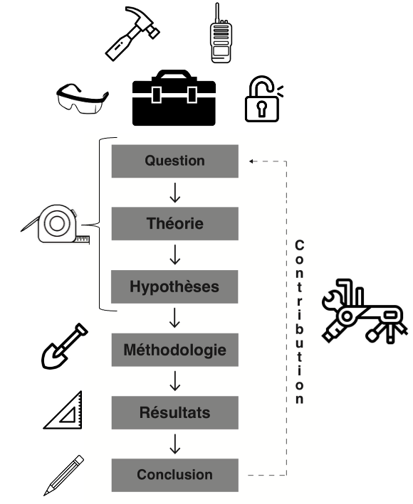
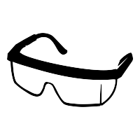
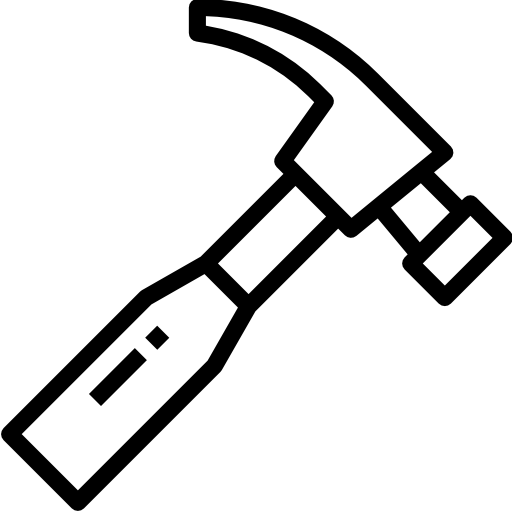
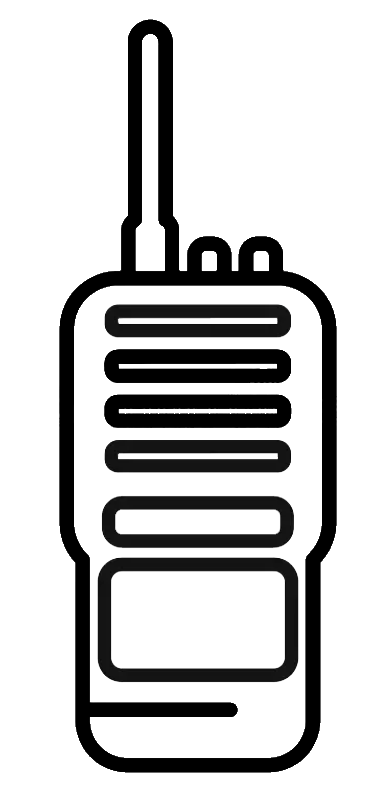
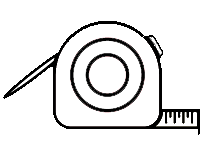
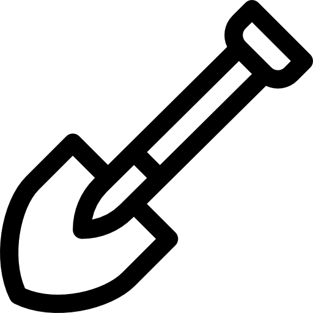
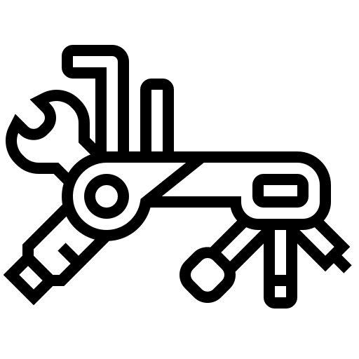

# Prélude {.unnumbered}

\begin{center}
\textit{Alexis Bibeau-Gagnon (Université McGill), \\
Adrien Cloutier (Université Laval), \\
Yannick Dufresne (Université Laval)}
\end{center}

Le premier conseil que nous donnons systématiquement à toute personne qui entame une carrière en recherche : apprenez à gérer votre temps… et les égos (y compris le vôtre). L’entrée dans le monde de la recherche en sciences sociales s’accompagne d’un paradoxe familier : il est tout à fait possible de dédier un nombre d’heures considérable à la recherche, tout en faisant usage de manière inefficace de ce temps. Il est trop commun de voir des gens s’exténuer à multiplier les tâches comme des poules sans tête, convaincus que le fait d’être occupé équivaut au fait de progresser. L’insécurité est omniprésente dans le monde académique. Devant l’immensité de la connaissance et des compétences possibles, on oscille entre le syndrome de l’imposteur et un narcissisme défensif. Ce vertige des possibilités nous pousse, parfois étrangement, à nous accrocher à ce que nous connaissons déjà et à rationaliser nos angles morts. Ce réflexe est compréhensible (et très humain), mais il est coûteux. Dans un contexte où les outils de recherche se multiplient et se transforment à une vitesse sans précédent, il est devenu franchement risqué.

Ces outils ont un potentiel transformatif immense pour le travail scientifique. Mais ils représentent également de redoutables gouffres de temps. Ça demande du courage de remettre en question ses manières de faire de la recherche. L'apprentissage de nouveaux outils nous force à réviser des habitudes parfois ancrées depuis longtemps. Beaucoup de chercheurs continuent de travailler avec l’équivalent académique d’un vieux marteau simplement parce que ça fonctionne « assez bien ». Un marteau est très utile et son utilisation est largement répandue dans la population, mais est-ce qu’un apprenti charpentier ne devrait pas apprendre à maîtriser des outils plus spécialisés comme une cloueuse pneumatique s’il veut en faire un métier? Il semble, en effet, judicieux de sélectionner les outils optimaux qui nous permettront d’exceller dans les tâches spécifiques liées à notre travail. Pourquoi serait-ce différent pour la recherche ?

Ce livre défend l’idée que la maîtrise des outils numériques spécialisés est devenue indispensable pour faire de la recherche rigoureuse, reproductible et transparente. Leur apprentissage offre un avantage considérable à ceux et celles qui se destinent à une carrière en recherche, dans le monde universitaire comme ailleurs.

L’objectif de ce livre est aussi d’éliminer les barrières à l’utilisation de certaines méthodes de recherche. Nous ne prenons pas parti dans le clivage qualitatif/quantitatif. Notre vision commune repose plutôt sur l’idée que les chercheurs en sciences sociales doivent utiliser les méthodes les plus appropriées à leurs questions de recherche [@shapiro02]. Certaines questions nécessitent l’utilisation de modèles statistiques complexes, d’autres des entretiens, des archives ou même une pelle. Il n’y a pas de hiérarchie de valeur. La recherche est comme une lampe de poche qui éclaire un phénomène, et la multiplication des angles d’éclairage ne peut qu’être bénéfique à notre savoir collectif. 

Toutefois, il existe des méthodes plus ou moins appropriées selon les questions de recherche, et aucune formation ne devrait restreindre ces choix. En ce sens, nous croyons fermement que la formation aux outils de recherche peut permettre à tous d’avoir une boîte à outils suffisamment fournie pour choisir la meilleure méthode pour répondre à des questions de recherche sur la seule base de sa valeur scientifique. L’apprentissage des outils permet ainsi d’éviter des choix méthodologiques sous-optimaux qui sont faits non par conviction, mais par manque de compétences techniques. 

Ce livre est ancré dans les sciences sociales (c’est son contexte de naissance, son terrain naturel, et le cadre de référence de ses exemples). Mais les outils qu’il présente sont fondamentalement interdisciplinaires. $\textsf{R}$, Git, Zotero, Quarto ou l’intelligence artificielle ne connaissent pas les frontières entre la sociologie, l’histoire, la communication, la santé publique, le droit ou l’éducation. Des chercheurs de toutes ces disciplines les utilisent quotidiennement, pour des questions radicalement différentes. Le lecteur issu d’une discipline voisine y trouvera tout autant son compte. Les exemples y sont peut-être moins nombreux dans son domaine spécifique, mais les outils, eux, lui appartiennent.

L’ère numérique a fait exploser le nombre de nouveaux outils permettant de collecter, de gérer et d’analyser le volume lui aussi croissant de données disponibles. La rapidité d’innovation technique dans ce domaine peut donner le vertige. Gestion de données massives, extraction automatisée, plateformes collaboratives, langages de programmation, génération de graphiques visuels, intelligence artificielle, etc. Chaque besoin en recherche est devenu une opportunité pour développer un nouvel outil. Mais le problème, c’est qu’à force de proliférer, il existe aujourd’hui un océan d’outils qui comportent tous leur propre courbe d’apprentissage, leur propre spécificité et qui sont parfois incompatibles entre eux… C’est un océan difficile à naviguer. Comme c’est souvent le cas, la technologie peut simplifier nos vies mais, par manque de coordination, finir par la complexifier. 

L’arrivée de l’intelligence artificielle générative a ajouté une nouvelle couche à ce paradoxe. Depuis 2022, des outils comme *ChatGPT* ont fait irruption dans les pratiques de recherche avec une rapidité déconcertante, soulevant une question que beaucoup se posent maintenant sincèrement : pourquoi investir des heures à apprendre $\textsf{R}$, Git ou Zotero si une IA peut tout faire à notre place ? C’est une question légitime. Et la réponse de ce livre est claire : parce que l’IA amplifie un chercheur compétent. Elle ne remplace pas les fondations. Un chercheur qui ne maîtrise pas ses outils ne sera pas libéré par l’IA. Il en sera dépendant, sans pouvoir évaluer la qualité de ce qu’elle produit. La maîtrise des outils numériques n’est pas rendue obsolète par l’intelligence artificielle. Elle est devenue la condition pour en faire un usage éclairé.

Ce livre est né dans une salle de classe. Il est le fruit d’une expérience d’enseignement menée à la Chaire de leadership en enseignement des sciences sociales numériques (CLESSN) de l’Université Laval, où le constat s’est imposé année après année : les étudiants en sciences sociales arrivent avec de bonnes questions, mais sans les outils pour y répondre efficacement. Cet ouvrage est notre tentative de combler ce fossé.

Huit ans. C'est le temps qu'il a fallu pour arriver jusqu'ici. Le contenu a été réécrit, retesté, parfois abandonné, souvent repris. Des outils que nous enseignions ont disparu ; d'autres ont émergé sans crier gare. La pandémie a tout bouleversé. L'intelligence artificielle générative a changé les règles du jeu en cours de route. Depuis 2024, ce contenu a pris la forme d'un cours officiel à l'Université Laval (POL-6078, *Outils numériques en sciences sociales*), où les étudiants contribuent directement au livre via des *pull requests* sur le dépôt *GitHub* du projet. Ce livre porte leur empreinte, même quand leurs noms n'y apparaissent pas.

Il est aussi rédigé en français, et ce choix n’est pas anodin. La quasi-totalité des ressources de qualité sur les outils numériques de recherche est disponible en anglais. Écrire ce livre en français est un acte délibéré de démocratisation, à l’intention de toute la communauté scientifique francophone, au Québec et ailleurs.

Il n’est pas non plus définitif. Il a été conçu pour évoluer avec les technologies, les usages, les retours de la communauté. Ce qu’il pose, en revanche, a vocation à durer : une réflexion sur ce que c’est que de choisir ses outils, et pourquoi cette réflexion est si souvent absente de la formation en sciences sociales. On y apprend les méthodes. Rarement les outils. Pourtant ce sont deux choses fondamentalement différentes : la méthode offre la recette, l’outil fournit l'équipement. L’un sans l’autre, c’est un chercheur à moitié équipé.

Les résultats sont là. Depuis les premières sessions du cours, des étudiants ont décroché des contrats en recherche, en partie grâce aux compétences acquises ici. Des messages de remerciement nous parviennent régulièrement. Ce monde peut sembler rude au premier abord, la courbe d’apprentissage abrupte. Mais en y allant étape par étape, chapitre par chapitre, on entre dans un univers riche, vibrant et profondément utile pour toute une carrière.

Ce qui distingue aussi cet ouvrage de la plupart des manuels de méthodes : tous les auteurs et autrices des chapitres étaient encore étudiants au moment de la rédaction. Les chapitres qui suivent ont été rédigés par des personnes qui ont elles-mêmes traversé la courbe d’apprentissage de ces outils, souvent sans formation préalable. Nous espérons que cette proximité avec l’expérience de l’apprentissage rendra le livre plus utile à ceux et celles qui en sont au même point.

C'est aussi pourquoi cet ouvrage ne prétend pas être exhaustif. Il ne recense pas tous les outils disponibles, ne couvre pas toutes les méthodes, et ne remplace pas une formation approfondie en statistiques ou en méthodologie de recherche. C’est une sélection assumée : les auteurs ont fait des choix, les ont défendus, et les assument. Le critère ultime n’était pas la popularité ni la nouveauté, mais la valeur réelle pour un chercheur en sciences sociales qui veut travailler de manière rigoureuse, reproductible et autonome.

Car c’est bien d’autonomie qu’il s’agit. Le chercheur qui ne choisit pas ses outils laisse ses outils dicter sa méthode. Et la méthode dictée par les contraintes techniques plutôt que par la question de recherche est rarement la meilleure.

Ces choix reposent sur six critères appliqués systématiquement à chaque outil présenté dans ce livre (détaillés au @sec-chap1) : 

1. Accessibilité *(Qui peut accéder à cet outil, et à quel coût ?)* ;
2. Existence d’une communauté active *(En cas de problème, vers quelle communauté se tourner ?)* ;
3. Popularité dans la discipline *(Cet outil facilite-t-il la collaboration avec mes pairs ?)* ;
4. Compatibilité avec d’autres outils *(S’intègre-t-il dans mon flux de travaux existant ?)* ;
5. Transparence et réplicabilité *(Un collègue pourrait-il reproduire mon travail avec cet outil ?)* ;
6. Adaptabilité et flexibilité *(Évoluera-t-il avec mes besoins ?)*.

Ces critères sont techniques, mais le choix d'un outil n'est jamais un acte neutre. Derrière chaque décision se cache une posture : certains outils concentrent le pouvoir entre les mains de quelques entreprises, d'autres le distribuent à une communauté ouverte. Certains rendent la recherche reproductible et vérifiable ; d'autres l'opacifient. Choisir, ou ne pas choisir, c'est donc aussi prendre position. Le @sec-chap1 développe cette réflexion en profondeur, à travers la philosophie du logiciel libre et du code source ouvert. Elle traverse aussi le reste du livre : les enjeux éthiques de la collecte de données (au @sec-chap6) ou de l'usage de l'intelligence artificielle (au @sec-chap9) en sont des manifestations concrètes. Nous ne prétendons pas offrir de réponses définitives, mais nous croyons que poser ces questions fait partie de la formation d'un chercheur.

La reproductibilité d'une recherche passe aussi par la citation explicite des outils utilisés et la transparence sur les raisons de leur choix. Cette pratique reste pourtant rare dans les publications en sciences sociales [@arel-bundock_mccrain23]. Ce livre en fait un principe structurant : chaque outil présenté est accompagné des raisons qui ont guidé sa sélection. Nous encourageons d'ailleurs les chercheurs à adopter cette même rigueur dans leurs propres travaux : citer les logiciels et outils utilisés dans une publication, c'est permettre à d'autres de reproduire, d'évaluer et de bâtir sur ce travail. Cette transparence est elle-même une forme de responsabilité scientifique.

Ainsi, les réponses à ces questions varient selon le contexte : la discipline, l’institution, l’époque, les valeurs, le type de recherche, la taille de l’équipe, les ressources disponibles, les technologies émergentes. Un chercheur en sociologie qualitative, une équipe de science politique computationnelle ou un étudiant au doctorat dans une université à ressources davantage limitées n’arriveront pas nécessairement aux mêmes choix. C’est normal, et c’est même souhaitable. Les choix éditoriaux de ce livre reflètent un contexte précis : des sciences sociales numériques, en 2026, pour un lectorat francophone en début de carrière. Dans dix ans, certaines de nos recommandations auront peut-être changé. Les 6 critères, eux, resteront pertinents.

Chaque chapitre de ce livre est structuré en trois sections pour guider cette réflexion. Le **Point d’observation** situe l’outil dans son contexte historique et conceptuel. L’**Arpentage et choix éditorial** présente les options disponibles, les compare selon les six critères, et explique les choix retenus dans ce livre (et les raisons qui les motivent). Le **Manuel d’instruction** offre un guide pratique pour commencer à utiliser l’outil retenu. Cette structure permet au lecteur de suivre notre raisonnement pas à pas, de le questionner, et d’en arriver à ses propres conclusions.

Ces outils sont présentés en trois sections, organisées comme on bâtit une maison.

Les **Fondations** (chapitres 1 à 4) posent les bases sans lesquelles rien de solide ne tient : choisir des outils libres et transparents, apprendre à programmer, organiser son flux de travaux et gérer ses données. On ne bâtit pas sur du sable.

La **Structure** (chapitres 5 à 8) couvre les étapes centrales du cycle de recherche : synthétiser la littérature, collecter des données, les visualiser et les rédiger. C’est la charpente du projet scientifique.

Les **Finitions** (chapitre 9) sont consacrées à l’intelligence artificielle. Ce n’est pas un hasard si ce chapitre arrive en dernier : l’IA présuppose tout ce qui précède. Les finitions révèlent la qualité du travail (elles ne le remplacent pas).

De la question initiale à la contribution finale, chaque étape du processus scientifique mobilise différents outils. C’est ce que représente la figure ci-dessous (notre boussole éditoriale pour l’ensemble de ce livre).

{fig-align="center" width="55%"}

---

Voici comment chaque chapitre s’inscrit dans cette progression.

{width="3%"} **Le monde du libre.** Le @sec-chap1 pose la question fondamentale : avec quels outils choisit-on de faire de la science, et pourquoi ? Les lunettes symbolisent le regard critique et philosophique qu’on pose sur les outils eux-mêmes : distinguer le logiciel libre du propriétaire, comprendre les valeurs qui les sous-tendent, juger leur compatibilité avec les exigences de la science ouverte. Ce chapitre pose aussi la distinction fondamentale entre outils et méthodes.

{width="3%"} **Outils de programmation.** La programmation est l’outil qui traverse tout le cycle de recherche. Comme le marteau sur un chantier, elle est présente à chaque étape : collecter des données, les transformer, les analyser, les visualiser, les communiquer. Le @sec-chap2 explique pourquoi $\textsf{R}$ s’est imposé comme le langage de référence en sciences sociales et propose une première immersion dans son environnement et sa logique.

{width="3%"} **Outils de gestion de projet.** Faire de la recherche, c’est souvent gérer de nombreuses tâches en parallèle : écrire, collaborer, déléguer, suivre, livrer. Le walkie-talkie symbolise cette coordination constante entre les membres d’une équipe, entre les projets et les échéances. Le @sec-chap3 introduit la méthode Agile et ses outils (comme *Notion*) pour structurer un flux de travaux efficace, que l’on travaille seul ou en équipe.

{width="3%"} **Outils de gestion des données.** Gérer ses données n’est pas une formalité administrative. C’est une décision scientifique fondatrice, prise dès le premier jour, qui engage la transparence et la reproductibilité de toute une recherche. Le @sec-chap4 outille cette discipline avec Git, *GitHub* et les dépôts institutionnels. Le cadenas ouvert en résume l’esprit : une science qui protège sans se fermer, qui structure pour que d’autres puissent vérifier, reproduire et bâtir.

{width="3%"} **Outils de synthèse de la connaissance.** Le @sec-chap5 défend la thèse que la revue de littérature est une contribution scientifique à part entière. Le ruban adhésif mesure et relie, comme la synthèse de la connaissance qui tisse les fils de la littérature existante pour en mesurer l'état, les lacunes, et y situer une nouvelle contribution. Le chapitre présente *Covidence* et *Zotero*, en insistant sur la traçabilité et la reproductibilité du processus.

{width="3%"} **Outils de collecte de données.** Le @sec-chap6 explore les multiples façons de collecter des données à l’ère numérique. La pelle creuse : elle symbolise l’acte central de la recherche empirique, la recherche des données. Le chapitre couvre les sondages en ligne (*Qualtrics*, *REDCap*), les bases de données médiatiques, et le *web scraping* avec `rvest`, tout en abordant les enjeux éthiques de la collecte numérique.

{width="3%"} **Outils de visualisation graphique.** Le @sec-chap7 couvre la visualisation de bout en bout, de  l'exploration initiale jusqu'à la communication des résultats, en s'appuyant sur `ggplot2` et sa grammaire des graphiques. C'est l'équerre qui mesure avec précision, calcule les angles et trace des lignes droites, pour offrir des résultats lisibles et communicables.

{width="3%"} **Outils de rédaction.** Le @sec-chap8 présente les langages de balisage (\LaTeX, `Quarto`, Markdown) comme alternatives aux traitements de texte traditionnels et propriétaires. Le crayon écrit : il représente l’acte final du cycle, mettre en forme et publier sa contribution. Plus propres, plus stables, plus reproductibles, ces outils permettent une rédaction scientifique à la hauteur des exigences modernes.

{width="3%"} **Outils d'intelligence artificielle.** Le @sec-chap9 présente les usages de l’intelligence artificielle en recherche. L’outil multifonction traverse le cycle en entier, comme l’IA qui peut intervenir à chaque étape, de la revue de littérature à la rédaction. Mais cette puissance présuppose tout ce qui précède. Le chapitre invite le chercheur à développer un regard critique sur ces outils dont les biais, les limites et les implications épistémologiques sont encore mal compris.

{width="3%"} **L’ordinateur.** L'@sec-annexe, probablement à consulter d’emblée pour certains chercheurs en herbe, démystifie l’environnement matériel de la recherche numérique. Un bon coffre est une base nécessaire pour entreposer tous les outils. RAM, processeur, stockage : cette annexe explique comment choisir une machine adaptée aux exigences des sciences sociales numériques.

Avant les étudiants, il y a eu des collègues et des amis. Axel Déry, Nadjim Fréchet, Judith Bourque, Justine Béchard, William Poirier, Maria Alexandrov, Patrick Poncet et Camille Tremblay-Antoine ont travaillé sur les premières versions de ce contenu, souvent sans savoir ce qu'il deviendrait. Ce livre leur doit beaucoup.

Rien de tout cela n’aurait évolué sans les étudiants du cours POL-6078, qui ont contribué directement à son amélioration : une correction ici, une suggestion là, parfois une refonte complète d’un passage. C’est cette boucle entre l’enseignement et l’écriture qui fait de ce livre ce qu’il est. Merci à ces contributeurs (pseudonymes GitHub) : ChloeBlx, JanelLaplante, JuliaDulude, Juma2985, Lamiko17, LoicRobinson, MADUP212, NCA0226, NicholasGaudet, Noboe2025, Velomicka, VictorVerville, WilliamBeaudry, adja925, amedee-account, chiara032003, flavielachance, jd-ODD, katelinevalentin1-netizen, laurianne-martin, sarahdb1, theofaitdodo, tomlaf12, watellephil, zahramayo.

C’est à eux, et à tous ceux qui viendront après, que ce livre est dédié.
